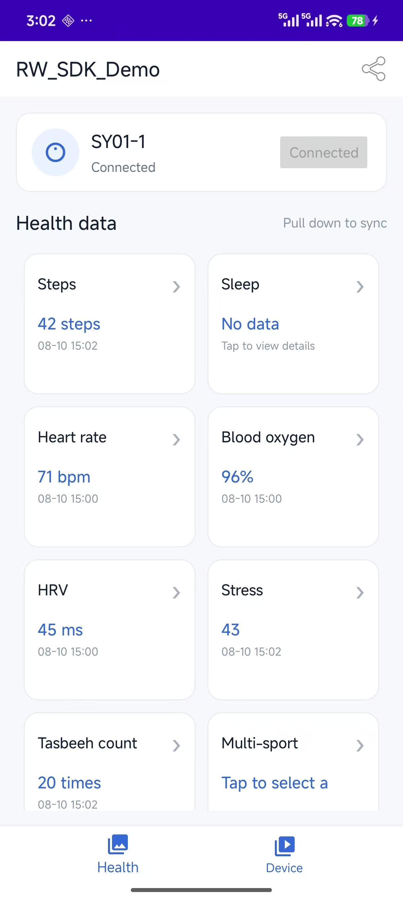
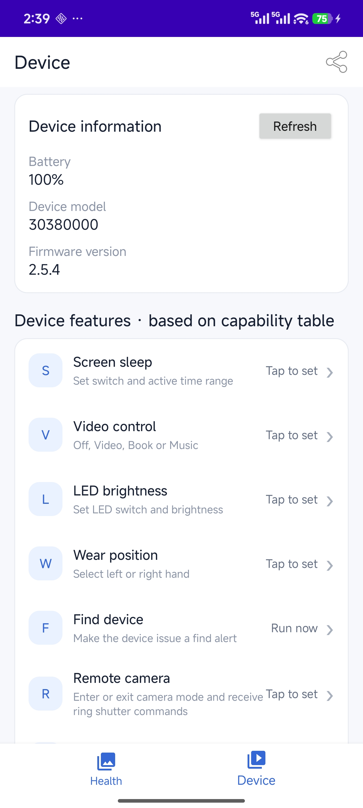

# RW Android SDK

RWFit Android BLE SDK — 用于智能戒指/手环设备的蓝牙通信开发套件。

RWFit Android BLE SDK — Bluetooth communication SDK for smart ring/band devices.

## 文档 / Documentation

- [中文文档](doc/blesdkandroid_zh.md)
- [English Documentation](doc/blesdkandroid_en.md)

## SDK 版本选择 / SDK Variants

两种版本的常规蓝牙及数据接口一致，区别在于是否支持 Nordic OTA。请在 [Releases](https://github.com/RWFitSDK/RW_Android_SDK/releases) 查看发布版本，AAR 文件也可从 [libs](libs/) 下载。**请选择一个 RW SDK AAR，不要同时引入多个版本。**

Both variants share the same standard Bluetooth and data APIs; the nordic variant also supports Nordic OTA. See [Releases](https://github.com/RWFitSDK/RW_Android_SDK/releases) for published versions, or download AAR files from [libs](libs/). **Include only one RW SDK AAR.**

| 版本 / Variant | AAR 文件名 / Filename | OTA 支持 / Support |
| --- | --- | --- |
| basic | `blesdk-rwfit-release_v2_261008.aar` | RW OTA |
| nordic | `blesdk-rwfit-nordic-release_v2_261008.aar` | RW OTA + Nordic OTA |

不需要 Nordic OTA 时，选择 basic 即可。Demo 使用 nordic 版本。各版本所需依赖和编译环境，请参考[中文文档](doc/blesdkandroid_zh.md)「快速开始 → 第2步」。

Choose basic if you do not need Nordic OTA. The Demo uses nordic. For dependencies and build requirements, see **Quick Start → Step 2** in the [English documentation](doc/blesdkandroid_en.md).

## Demo 展示 / Demo Preview

  
  

## License

[MIT License](LICENSE)
