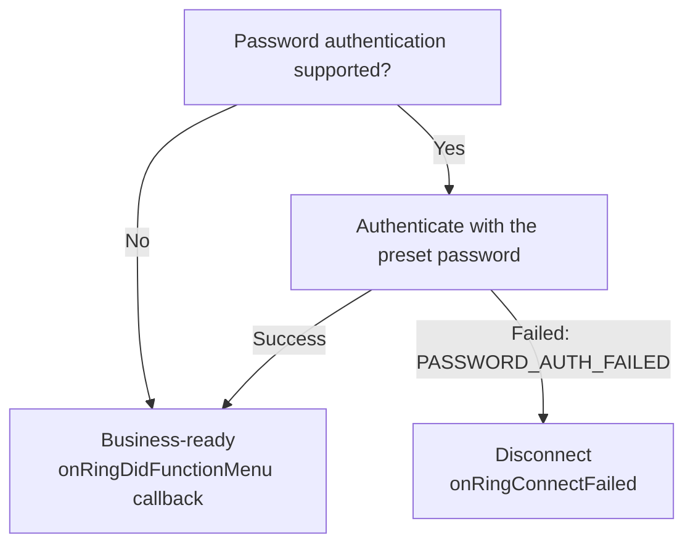

# RW BLE Android SDK User Manual

## 1. Introduction

This document mainly explains the functional interfaces and usage scenarios provided in the SDK.

This document is only applicable to RW's Bluetooth devices.

#### 1.1 Applicable platforms and languages

- Android 8.0 and above, language Kotlin.

#### 1.2 Related terms

- App: This article refers to applications running on mobile phones or tablets;

- Device: This article refers to wearable hardware devices: such as watches, rings, etc.;

  

#### 1.3 Precautions

1. It is best to use this SDK in conjunction with the sample project `RW_SDK_DEMO`; for reference, just focus on the two pages of `NewMainActivity` and `ScanActivity`.

2. Most of the command operations of `DHBleSdk` are implemented by subscribing to the corresponding callback `DHBleSdk.subscribeData()`; when no longer in use, please unsubscribe `DHBleSdk.dispose()`;

   

   

## 2. Quick Start

**Step 1: Get the latest version of Android Studio.**

To use the RW BLE SDK for Android in your development project, you need to install Android Studio.

**Step 2: Manually deploy and add the dependency libraries.**

Import the AAR file into your project's build.gradle file.

```groovy
implementation files('libs/blesdk_rwfit_release_260130.aar')
```


## SDK Revision History

**V2.0.0_20260817** (2026.08.17)

- Added instant screen control (3.2.1.27).
- Fixed alarm retrieval so that `onResult` returns an empty list when the device has no alarms.
- Added the available-firmware endpoint and OTA device-model/version validation guidance (3.2.3.1).

**V2.0.0_20260724** (2026.07.24)

- Added support for step-detail intervals.


**Step 3: You need to enable Bluetooth on your phone and grant Bluetooth and location permissions.**

```kotlin
    private fun getBluePermissions(): List<String> {
        val permissions = mutableListOf<String>()
        permissions += Permission.BLUETOOTH_SCAN
        permissions += Permission.BLUETOOTH_ADVERTISE
        permissions += Permission.BLUETOOTH_CONNECT
        permissions += Permission.ACCESS_COARSE_LOCATION
        permissions += Permission.ACCESS_FINE_LOCATION
        return permissions
    }
```

**Step 4: Initialize the SDK**

```kotlin
DHBleSdk.initSDK(this)
```

>  [!CAUTION]
>
> Bluetooth log files will be saved by default in the `Data/appid/logger/devices/` folder. This can be disabled using `XLogUtils.setLogEnable(false)`.


**SDK obfuscation**

The release AAR already obfuscates the SDK's internal implementation and includes consumer rules that preserve its public API. When the AAR is integrated normally through Gradle, these rules are merged automatically into the application's R8/ProGuard configuration, so no additional rules are normally required.

If the AAR is repackaged in a way that discards its consumer rules, add the following fallback rules to the application's ProGuard configuration:

```proguard
-keepattributes Signature,*Annotation*,InnerClasses,EnclosingMethod

-keep class com.example.blesdk.DHBleSdk { *; }

-keep class com.example.blesdk.ble.** { *; }
-keep class com.example.blesdk.rwbaselibrary.HandlerCallback { *; }

-keep class com.example.blesdk.bean.** { *; }
-keep class com.example.blesdk.callback.** { *; }

-keep class com.example.blesdk.blering.BaseDataCallback { *; }
-keep class com.example.blesdk.blering.DeviceDataCallback { *; }
-keep class com.example.blesdk.blering.BaseAnswerCallback { *; }
-keep class com.example.blesdk.blering.RingConnectBleCallback { *; }
-keep class com.example.blesdk.blering.RingBleError { *; }

-keep class com.example.blesdk.utils.** { *; }
```


## 3. API Reference

### 3.1 Device search and connection, binding and reconnection.

##### 3.1.1 Search for Bluetooth devices

>  Interface description: To search for Bluetooth devices, you need to initialize `ScanBleService` first and implement the `ScanDeviceCallback` callback interface.

```kotlin
// 1. Initialize and register the callback.
ScanBleService.getService().initBle(this)
ScanBleService.getService().registerScanBleCallback(this)

// 2. Start searching
ScanBleService.getService().startScan(true,null)

//3. The ScanDeviceCallback interface will provide callbacks for the discovered Bluetooth devices.
public interface ScanDeviceCallback {
  public void onScanDevice(BleDevice device);
  public void onScanFinish();
  public void onError(int errorCode,Exception e);
}

//4. Unregister callback
ScanBleService.getService().unRegisterScanBleCallback()
```

##### 3.1.2 Stop searching

> Interface description: Stop searching for Bluetooth devices.

```kotlin
ScanBleService.getService().stopScan()
```


##### 3.1.3 Device connection and status monitoring

> Interface description: Connects to the specified device and monitors the device's connection status.

```kotlin
// 1. Initialize and register the callback.
DHBleSdk.setConnectBleCallback(this)

// 2. Connect devices
DHBleSdk.connectDeviceWithModel(bleDevice)

// 3. Implement and receive callbacks for Bluetooth connection status.
interface RingConnectBleCallback {
  fun onRingConnecting(device: BleDevice?)
  fun onRingConnected(device: BleDevice?)
  fun onRingConnectFailed(device: BleDevice?, reason: RingBleError = RingBleError.UNKNOWN)

  fun onRingDidFunctionMenu(device: BleDevice?, supportMenuBean: SupportMenuBean)
}
```

`RingConnectBleCallback` Interface Description:

| 方法                  | 说明                                                         |
| :-------------------- | ------------------------------------------------------------ |
| onRingConnecting      | Connecting                                                   |
| onRingConnected       | After calling `connectDeviceWithModel`, the function will return upon successful connection. |
| onRingConnectFailed   | Called when connection fails or disconnects. For password authentication failure, `reason` is `PASSWORD_AUTH_FAILED`. |
| onRingDidFunctionMenu | The function will return after successfully obtaining the device configuration table; business operations should be performed after this point. |

>   [!TIP]
>
>  After connecting, business operations should only be performed after the `onRingDidFunctionMenu` event.


##### 3.1.4 Disconnect the device.

> Interface description: Disconnect the currently connected device and monitor the device connection status.

```kotlin
 DHBleSdk.disconnect()
```

##### 3.1.5 Local binding and automatic reconnection, unbinding

>  [!IMPORTANT]
>
> Android local binding requires manual implementation of automatic reconnection; this SDK does not provide this functionality.  After a successful connection, you can save the MAC address and necessary configuration information for convenient display and reconnection on the user interface.


##### 3.1.6 Equipment Function Configuration Table

>   [!IMPORTANT]
>
>  Due to the variety of device models and their differing supported features, a feature list has been introduced to allow users to check the supported features of each device.  Please refer to the `SupportMenuBean` class for details. You can save the feature list content according to your specific business requirements.

`  fun onRingDidFunctionMenu(supportMenuBean:SupportMenuBean)`

DeviceFuncV2Model class attribute definitions:

| SupportMenuBean attribute   | Description                                                  |
| --------------------------- | ------------------------------------------------------------ |
| isPushMsgEnableSwitch       | Enable or disable the message control switch?                |
| pushMsgSwitchValue          | Supported message types, low 32 bits (bit0-bit31)            |
| pushMsgSwitchValue2         | Supported message types, high 32 bits (bit32-bit63); defaults to 0 on old devices |
| activityDataInterval        | Today's step-detail interval in minutes; an unconfigured value is normalized to 60 |
| isAlarm                     | Does it support an alarm clock?                              |
| isBrightScreenSleepTime     | Does it support screen sleep time settings?                  |
| isBrightScreenTime          | Does it support screen-on time adjustment?                   |
| isNewSport                  | Does it support multiple sports modes?                       |
| isRememberSwitch            | Does it support enabling/disabling Muslim prayers?           |
| isSupportHrReminder         | Does it support HR (heart rate) alarm notification function? |
| isSupportBoReminder         | Does it support SpO2 alarm notification functionality?       |
| isSupportMotoVibrationLevel | Does it support motor vibration alerts?                      |
| isSupportAlarmVibrationDuration | Does it support alarm vibration duration setting?        |
| isSupportVibrationInterval  | Does it support vibration interval setting?                |
| isStep                      | Does it support step counting?                               |
| isHr                        | Does it support heart rate monitoring?                       |
| isBloodPress                | Does it support blood pressure measurement?                  |
| isSleep                     | Does it support sleep mode?                                  |
| isBloodOxy                  | Does it support blood oxygen monitoring?                     |
| isHrv                       | Does it support heart rate variability?                      |
| isPressure                  | Does it support pressure?                                    |
| isBloodSugar                | Does it support blood glucose monitoring?                    |
| isMuslimCountData           | Do you support praise?                                       |
| isDataTypeTemperature       | Does it support temperature monitoring?                      |
| isSupportMuslimTimeDisplayMode | Does it support Muslim time display mode?                  |
| isSupportSensorRawPPG       | Does it support PPG raw data?                                |
| isSupportPPGMonitoring      | Does it support PPG timed monitoring?                        |
| isSupportTemperatureMonitoring | Does it support temperature timed monitoring?             |
| isSupportCountReminder      | Does it support count reminder interval setting?             |
| isSupportSensorRawACC       | Does it support ACC raw data?                                |
| isSupportSensorRawPPGRed    | Does it support PPG Red raw data?                            |
| isSupportSensorRawIR        | Does it support IR (infrared) raw data?                      |
| isSupportSensorRawSleep     | Does it support sleep real-time data?                        |
| isSupportFallDetect         | Does it support fall detection alert?                        |
| isSupportRecording          | Does it support recording function?                          |
| isSupportDevicePasswordAuth | Does it support device password authentication?              |
| isSupportScreenControl      | Does it support instant screen on/off control?                |


### 3.2 Device function operation

#### 3.2.1 Basic function command interface

##### 3.2.1.1 Get SDK Version

> Get the SDK version number.

Method Description: 

`DHBleSdk.getSDKVersion()`

Example of usage:

```kotlin
Log.e("RWSDK", DHBleSdk.getSDKVersion())
```

##### 3.2.1.2 Set user information

> User information settings are related to step count, calories burned, and distance.  During device initialization, the default settings are: gender 1, age 18, height 170cm, and weight 65 kg.
>
> Subscribe to `CommonStatusCallback` to receive the results.

Method Description: 

`fun setUserInfo(personBean: PersonBean)`

Parameter Description:

| parameter  | type       | Description |                                                              |
| ---------- | ---------- | ---------- | ------------------------------------------------------------ |
| personBean | PersonBean | class      | gender: Gender (0. Female, 1. Male)<br/>height: Height in cm, floating-point number<br/>weight: Weight in kg, floating-point number<br/>age: Age |

Example of usage:

```kotlin
DHBleSdk.subscribeStatus(object : CommonStatusCallback{
  override fun onSuccess(id: Int) {
    Log.e("RWSDK", "user info set ok")
  }

  override fun onFail(id: Int, errorCode: Int) {
    Log.e("RWSDK", "user info set failed")
  }

})


val persionBean = PersonBean()
persionBean.measureUnit = 0
persionBean.gender = 1
persionBean.height = 170.5f
persionBean.weight = 80f
persionBean.age = 20
DHBleSdk.setUserInfo(persionBean)
```

##### 3.2.1.3 Get Device Information

> Get the device model, firmware version, screen information, and UI version.
>
> Subscribe to `FirmwareCallback` to receive the result.

Method Description:

`fun getFirmwareVersionJL()`

Return Value:

| FirmVersionBean property | Type   | Description                                      |
| ------------------------ | ------ | ------------------------------------------------ |
| deviceClazz              | String | Device model, the unique identifier for each product model |
| deviceNo                 | String | Firmware version                                 |
| screenType               | int    | Screen type: 0. square, 1. round                 |
| screenWidth              | int    | Screen width                                     |
| screenHeight             | int    | Screen height                                    |
| uiVersion                | String | UI version                                       |

> **Important:** Before a firmware upgrade, verify that the device's `deviceClazz` matches the device model supported by the firmware package. Proceed with the upgrade only when they match. Do not upgrade if they do not match.

Example of usage:

```kotlin
DHBleSdk.subscribeData(object : FirmwareCallback {
  override fun onSuccess() {
  }

  override fun onFail(errorCode: Int) {
    Log.e("RWSDK", "firmware info get failed, errorCode=$errorCode")
  }

  override fun onResult(data: FirmVersionBean?) {
    data?.let {
      Log.e("RWSDK", "firmware info --> $it")
    }
  }
})

DHBleSdk.getFirmwareVersionJL()
```

##### 3.2.1.4 Get Battery Level

> Get the device's battery level.
>
> Subscribe to `PowerCallback` to receive the result.

Method Description:

`fun getPowerJL()`

Return Value:

| PowerBean property | Type | Description                    |
| ------------------ | ---- | ------------------------------ |
| power              | int  | Remaining battery level, 0-100 |

Example of usage:

```kotlin
DHBleSdk.subscribeData(object : PowerCallback {
  override fun onSuccess() {
  }

  override fun onFail(errorCode: Int) {
    Log.e("RWSDK", "power get failed, errorCode=$errorCode")
  }

  override fun onResult(data: PowerBean?) {
    data?.let {
      Log.e("RWSDK", "power --> $it")
    }
  }
})

DHBleSdk.getPowerJL()
```

##### 3.2.1.5 Getting and Setting Video Control Switch

> Sets whether to enable ring gesture control for watching videos; <u>This function requires Bluetooth HID pairing.</u> HID pairing can be done using `BlueToothUtils createOrRemoveBond` (type 1 for pairing, 2 for unpairing), or you can implement it yourself.
>
> Subscribe to `videoHidCallback` to get the result.

Method Description:

`fun setVideoHidJL(videoHidBean: VideoHidBean)`

Parameter Description:

| Parameter    | Type         | Description | Value                                        |
| ------------ | ------------ | ----------- | -------------------------------------------- |
| videoHidBean | VideoHidBean | Class       | hidOpen: 0. Off 1. Video On 2. Book 3. Music |

Example of usage:

```kotlin
// Set video control switch
DHBleSdk.subscribeData(videoHidCallback)
val videoHidBean = VideoHidBean()
videoHidBean.hidOpen = 1  //Whether to open short video control
DHBleSdk.setVideoHidJL(videoHidBean)

// Get video control switch
DHBleSdk.subscribeData(videoHidCallback)
DHBleSdk.getVideoHidJL()
```

> `VideoHidCallback` only returns the result of setting or reading the control mode. When music mode is enabled with `hidOpen = 3`, also subscribe to `MusicPushSettingCallback` to receive music control commands actively reported by the device.

```kotlin
val musicPushCallback = object : MusicPushSettingCallback {
    override fun onResult(data: Int?) {
        when (data) {
            3 -> { /* Previous */ }
            4 -> { /* Next */ }
        }
    }

    override fun onFail(errorCode: Int) {}
    override fun onSuccess() {}
}

DHBleSdk.subscribeData(musicPushCallback)
val musicMode = VideoHidBean().apply { hidOpen = 3 }
DHBleSdk.setVideoHidJL(musicMode)

// Remove the listener when music control events are no longer needed.
DHBleSdk.dispose(musicPushCallback)
```

##### 3.2.1.6 Getting and Setting LED Screen Brightness

> Configuration table attribute: `isLEDLight`;
>
> Subscribe to `BrightLedLevelCallback` to get the result.

Method Description:

`fun setRingLedLevel(brightScreenBean: BrightScreenLedBean)`

Parameter Description:

| Parameter        | Type                | Description | Value                                                        |
| ---------------- | ------------------- | ----------- | ------------------------------------------------------------ |
| brightScreenBean | BrightScreenLedBean | Class       | isOpen: false for off, true for (1-3 Level)<br>lcdLevel: 1 Dim light, 2 Soft light, 3 Strong light |

Example of usage:

```kotlin
// Get LED screen brightness
DHBleSdk.subscribeData(brightLedLevelCallback)
DHBleSdk.getRingLedLevel()

// Set LED screen brightness
DHBleSdk.subscribeData(brightLedLevelCallback)
val tBrightScreenLedBean = BrightScreenLedBean()
tBrightScreenLedBean.isOpen = true //false is off, true is (1-3Level)
tBrightScreenLedBean.lcdLevel = 3 //1-3Level: 1 low 2 mid 3 high
DHBleSdk.setRingLedLevel(tBrightScreenLedBean)
```

##### 3.2.1.7 Get and Set Wearing Position

> Get or set the hand on which the ring is worn.
>
> Function table property: `isWearDir`.
>
> Subscribe to `WearHandCallback` to receive the result.

Method Description:

`fun getRingWearDir()`

`fun setRingWearHand(isOpen: Boolean)`

Parameter Description:

| Parameter | Type    | Description      | Value                              |
| --------- | ------- | ---------------- | ---------------------------------- |
| isOpen    | Boolean | Wearing position | false. left hand, true. right hand |

Return Value:

| FactoryInBean property | Type | Description                            |
| ---------------------- | ---- | -------------------------------------- |
| isOpen                 | int  | Wearing position: 0. left, 1. right    |

Example of usage:

```kotlin
val wearHandCallback = object : WearHandCallback {
  override fun onSuccess() {
    Log.e("RWSDK", "wear hand operation success")
  }

  override fun onFail(errorCode: Int) {
    Log.e("RWSDK", "wear hand operation failed, errorCode=$errorCode")
  }

  override fun onResult(data: FactoryInBean?) {
    data?.let {
      Log.e("RWSDK", "wear hand=${it.isOpen()}")
    }
  }
}

DHBleSdk.subscribeData(wearHandCallback)

// Get wearing position
DHBleSdk.getRingWearDir()

// Set wearing position to the left hand
DHBleSdk.setRingWearHand(false)

// Set wearing position to the right hand
DHBleSdk.setRingWearHand(true)
```

##### 3.2.1.8 Start and Stop Photo Taking

> Enable photo control when the APP enters its custom camera page. Once enabled, the device can notify the APP through gestures to take a photo. Disable photo control when the APP exits the camera page.
>
> Function table property: `isTakePhoto`.
>
> Subscribe to `TakePhotoCallback` to receive photo notifications from the device.

Method Description:

`fun controlTakePhotoJL(controlType: Int)`

Parameter Description:

| Parameter   | Type | Description   | Value                              |
| ----------- | ---- | ------------- | ---------------------------------- |
| controlType | Int  | Photo control | 0. disable photo, 1. enable photo  |

Return Value:

| Callback data | Type | Description                         |
| ------------- | ---- | ----------------------------------- |
| data          | Int  | 2. device notifies the APP to take a photo |

Example of usage:

```kotlin
private val takePhotoCallback = object : TakePhotoCallback {
  override fun onSuccess() {
    Log.e("RWSDK", "take photo control success")
  }

  override fun onFail(errorCode: Int) {
    Log.e("RWSDK", "take photo control failed, errorCode=$errorCode")
  }

  override fun onResult(data: Int?) {
    if (data == 2) {
      // The device sends a photo notification. Take a photo here using the APP's custom camera.
    }
  }
}

// Call when the APP enters the camera page.
fun onCameraPageOpened() {
  DHBleSdk.subscribeData(takePhotoCallback)
  DHBleSdk.controlTakePhotoJL(1)
}

// Call when the APP exits the camera page.
fun onCameraPageClosed() {
  DHBleSdk.controlTakePhotoJL(0)
  DHBleSdk.dispose(takePhotoCallback)
}
```

##### 3.2.1.9 Finding the Device

> After calling the find function, the device's light or screen will light up.

Method Description:

`fun controlFindDeviceJL()`

Example of usage:

```kotlin
DHBleSdk.controlFindDeviceJL()
```

##### 3.2.1.10 Shutdown, Factory Reset

> Subscribe to `DeviceControlCallback` to get the result.

Method Description:

`fun setPowerOffJL(type: Int)`

Parameter Description:

| Parameter | Type | Description | Value                                                        |
| --------- | ---- | ----------- | ------------------------------------------------------------ |
| type      | Int  | Integer     | Shutdown: Constants.CONTROL_DEVICE_POWER_OFF<br>Factory Reset: Constants.CONTROL_DEVICE_RECOVERY |

Example of usage:

```kotlin
// Shutdown
DHBleSdk.setPowerOffJL(Constants.CONTROL_DEVICE_POWER_OFF) //Shutdown

// Factory Reset
DHBleSdk.setPowerOffJL(Constants.CONTROL_DEVICE_RECOVERY) //Factory Reset

// You can subscribe to the DeviceControlCallback callback
```

##### 3.2.1.11 Alarm Clock

###### 3.2.1.11.1 Getting Set Alarms

> Configuration table attribute: `isAlarm`
>
> Subscribe to the `AlarmCallback` callback;

Method Description:

`DHBleSdk.getAlarmRemindJL();`

Example of usage:

```kotlin
// Get the alarms saved on the device
DHBleSdk.subscribeData(alarmCallback)
DHBleSdk.getAlarmRemindJL()
```

###### 3.2.1.11.2 Setting Alarms

> **The current protocol does not support modifying alarms individually. Any operation to switch on/off or delete a single alarm requires resending all alarm configurations.** **
>
> Subscribe to the `AlarmCallback` callback;

Method Description:

`fun setAlarmRemindJL(reminderBeans: List<AlarmRemainderBean>)`

Parameter Description:

| Parameter     | Type                     | Description | Value                                                        |
| ------------- | ------------------------ | ----------- | ------------------------------------------------------------ |
| reminderBeans | List<AlarmRemainderBean> | Alarm array | isOpen: true/false<br>repeatModel: IntArray(7) Sunday to Saturday, set to 1 for days to repeat<br>startHour: Alarm start hour<br>startMin: Alarm start minute<br>alarmTag: Set to an empty string; |

Example of usage:

```kotlin
// Set alarm
DHBleSdk.subscribeData(alarmCallback)

val params = mutableListOf<AlarmRemainderBean>()
val alarmRemainderBean = AlarmRemainderBean()
alarmRemainderBean.alarmTag = ""
alarmRemainderBean.repeatModel = IntArray(7) // Single time; Sunday to Saturday, set to 1 for days to repeat
alarmRemainderBean.startHour = 7
alarmRemainderBean.startMin = 0
alarmRemainderBean.isOpen = true
alarmRemainderBean.alarmId = 0
params += alarmRemainderBean

val alarmRemainderBean2 = AlarmRemainderBean()
alarmRemainderBean2.alarmTag = ""
alarmRemainderBean2.repeatModel = IntArray(7) // Single time; Sunday to Saturday, set to 1 for days to repeat
alarmRemainderBean2.startHour = 8
alarmRemainderBean2.startMin = 0
alarmRemainderBean2.isOpen = false
alarmRemainderBean2.alarmId = 0
params += alarmRemainderBean2

DHBleSdk.setAlarmRemindJL(params)
```

###### 3.2.1.11.3 Delete All Alarms

> `DHBleSdk.deleteAllAlarmRemindJL`;
>
> Subscribe to the `AlarmCallback` callback;

Method Description:

`DHBleSdk.deleteAllAlarmRemindJL`

```kotlin
//Subscribe to callback
DHBleSdk.subscribeData(alarmCallback)
//Delete all alarms
DHBleSdk.deleteAllAlarmRemindJL()
```

##### 3.2.1.12 Vibration Count Setting and Getting

> Configuration table attribute: `isSupportMotoVibrationLevel`
>
> Device vibration count;
>
> Subscribe to the `VibrationCountCallback` callback.

Method Description:

`fun setVibrationCount(level:Int, count: Int)`

`fun getVibrationCount()`

Parameter Description:

| Parameter | Type | Description | Value                                                        |
| --------- | ---- | ----------- | ------------------------------------------------------------ |
| level     | Int  | Integer     | Vibration intensity, 0: Off 1: Low 2: Medium 3: High; *Can be ignored if this function is not defined* |
| count     | Int  | Integer     | The number of vibrations can be set (0-6 times), initial default is 2 times. Setting to 0 means no vibration |

Example of usage:

```kotlin
//Setting
DHBleSdk.subscribeData(vibrationCountCallback)
DHBleSdk.setVibrationCount(1, 2) //Vibration count 2 times

//Getting
DHBleSdk.subscribeData(vibrationCountCallback)
DHBleSdk.getVibrationCount()
```

##### 3.2.1.13 Screen Sleep Mode Setting and Getting

> Sets screen sleep on/off and time;
>
> Configuration table attribute: `isBrightScreenSleepTime`
>
> Subscribe to `BrightTimeCallback` to get the result.

Method Description:

`fun setRingBrightScreenSleepTime(briScreenTime: BrightScreenTimeBean)`

`fun getRingBrightScreenSleepTime()`

Parameter Description:

| Parameter            | Type  | Description | Value                                                        |
| -------------------- | ----- | ----------- | ------------------------------------------------------------ |
| BrightScreenTimeBean | Class |             | isOpen, Switch ON YES or OFF NO<br>startHour, start time hour<br>startMin, start time minute<br>endHour, end time hour<br>endMin, end time minute |

Example of usage:

```kotlin
// Subscribe
DHBleSdk.subscribeData(brightTimeCallback)

// Set
val briScreenTime = BrightScreenTimeBean()
briScreenTime.isOpen = true
briScreenTime.startHour = 20 // Sleep from 8 PM to 8 AM
briScreenTime.startMin = 0
briScreenTime.endHour = 8
briScreenTime.endMin = 0

DHBleSdk.setRingBrightScreenSleepTime(briScreenTime)

// Get
DHBleSdk.getRingBrightScreenSleepTime()
```

##### 3.2.1.14 Messages and Calls

###### 3.2.1.14.1 Message Push

> APP actively pushes message notifications to the device (not ANCS). The message switch is controlled by the APP itself.

Method Description:

`fun setPushMsgJL(msgPushBean: MsgPushBean)`

Parameter Description:

| Parameter   | Type  | Description | Value                            |
| ----------- | ----- | ----------- | -------------------------------- |
| MsgPushBean | Class |             | See MsgPushBean class definition |

Example of usage:

```kotlin
val messageBean = MsgPushBean()
messageBean.appId = "com.ten.wenxin"
messageBean.title = "1111"
messageBean.content = "8888"
DHBleSdk.setPushMsgJL(messageBean)
```

###### 3.2.1.14.2 Call Control

> When the device triggers answering or rejecting a call, the APP should listen for the device command and perform the corresponding phone action.

Method Description:

`fun controlPhoneJL(controlType: Int)`

Parameter Description:

| Parameter   | Type | Description       | Value                          |
| ----------- | ---- | ----------------- | ------------------------------ |
| controlType | Int  | Call control type  | 0: Answer<br>1: Reject        |

Example of usage:

```kotlin
// Answer call
DHBleSdk.controlPhoneJL(0)

// Reject call
DHBleSdk.controlPhoneJL(1)
```

###### 3.2.1.14.3 Music Control

> When the device triggers previous-track or next-track control, the APP should listen for the device command and perform the corresponding action.
>
> Subscribe to `MusicPushSettingCallback` to receive device music control events.

MusicPushSettingCallback return values:

| Value | Description    |
| ----- | -------------- |
| 3     | Previous track |
| 4     | Next track     |

Example of usage:

```kotlin
DHBleSdk.subscribeData(object : MusicPushSettingCallback {
    override fun onResult(data: Int?) {
        when (data) {
            3 -> { /* Previous */ }
            4 -> { /* Next */ }
        }
    }
    override fun onFail(errorCode: Int) {}
    override fun onSuccess() {}
})
```

##### 3.2.1.15 Getting and Setting whether the Reminder Function is Enabled

> Set whether the reminder function is enabled;
>
> Configuration table attribute: `isRememberSwitch`
>
> Subscribe to `MuslimCountSwitchCallback` to get the result.

Method Description:

`fun deviceRememberSwitch(status: Int)`

`fun deviceRememberSwitchGet()`

Parameter Description:

| Parameter | Type | Description | Value           |
| --------- | ---- | ----------- | --------------- |
| status    | Int  |             | 0: Off<br>1: On |

Example of usage:

```kotlin
//set up
DHBleSdk.subscribeData(muslimCountSwitchCallback)
DHBleSdk.deviceRememberSwitch(1)

//Get
DHBleSdk.deviceRememberSwitchGet()

```

##### 3.2.1.16 Getting and Setting Heart Rate/Blood Oxygen Alarm Configuration

> This function sets the heart rate and blood oxygen notification alarm data; alarm notifications will be sent in real-time via `HrBoActualReminderCallback`.
>
> Configuration table attribute: `isSupportHrReminder`
>
> Subscribe to `HrReminderCallback` and `BoReminderCallback` to get the results.

Method Description:

`fun deviceGetHrAlertCmd()`

`fun deviceSetHrAlertCmd(status: Int, value: Int, underValue:Int)`

`fun deviceGetBoAlertCmd()`

`fun deviceSetBoAlertCmd(status: Int, value: Int)`

Parameter Description:

| Parameter  | Type | Description | Value                                                        |
| ---------- | ---- | ----------- | ------------------------------------------------------------ |
| status     | Int  |             | 1: On, <br>0: Off;<br>overValue: Alarm value, default value is heart rate exceeding 160, blood oxygen below 94%, |
| value      | Int  |             | Exceeding alarm value, default value is heart rate exceeding 160 |
| underValue | Int  |             | Below value alarm; If the retrieved value is 0xff, it means this function is not supported; |

**Note: If `underValue` obtained through `deviceGetHrAlertCmd()` is 0xff, it means this function is not supported.**

Real-time alarm return value HrBoActualReminderBean description:

| HrBoActualReminderBean Parameter | Type | Description | Value                                                        |
| -------------------------------- | ---- | ----------- | ------------------------------------------------------------ |
| type                             | Int  |             | 0: Heart rate exceeding alarm, <br>1: Blood oxygen alarm;<br>2: Heart rate below alarm |
| remindValue                      | Int  |             | Alarm value                                                  |

Example of usage:

```kotlin
//Setting
DHBleSdk.subscribeData(hrReminderCallback)
DHBleSdk.deviceSetHrAlertCmd(1, 140, 0xff)

//Getting
DHBleSdk.subscribeData(hrReminderCallback)
DHBleSdk.deviceGetHrAlertCmd()


//Alarm result notification push
DHBleSdk.subscribeData(hrBoActualReminderCallback) //Alert Message

private val hrBoActualReminderCallback by lazy {
  object : HrBoActualReminderCallback {
    override fun onResult(data: HrBoActualReminderBean) {
      Log.e("RWSDK", "output: HrBoActualReminderCallback data " + data.type + " value " + data.remindValue)
      if (data.type == 0) { // HR Over Value Alarm

      } else if (data.type == 1) { // SP02 Over Value Alarm

      } else if (data.type == 2) { // HR Under Value Alarm

      }
    }

    override fun onFail(errorCode: Int) {
      Log.e("RWSDK", "output: HrBoActualReminderCallback errorCode " + errorCode)
    }

    override fun onSuccess() {
      Log.e("RWSDK", "output: HrBoActualReminderCallback onSuccess")
    }

  }
}
```

##### 3.2.1.17 Get and Set Screen Brightness Duration

> Configuration table attribute: `isBrightScreenTime`
>
> Subscribe to `BrightTimeCallback` to get the result.

Method Description:

`fun getBrightScreenTimeJL()`

`fun setBrightScreenTimeJL(briScreenTime: BrightScreenTimeBean)`

Parameter Description:

| BrightScreenTimeBean Parameter | Type   | Description                                                  | Value |
| ------------------------------ | ------ | ------------------------------------------------------------ | ----- |
| timeSecond                     | Int    | Screen brightness duration, in seconds (s), range 0-30s;     |       |
| durationNums                   | String | Supported duration values by the device, separated by commas if available; |       |

Example of usage:

```kotlin
// Set
val briScreenTime = BrightScreenTimeBean()
briScreenTime.timeSecond = 10 // Screen brightness for 10s
DHBleSdk.subscribeData(brightTimeCallback)
DHBleSdk.setBrightScreenTimeJL(briScreenTime)

// Get
DHBleSdk.getBrightScreenTimeJL()

```

##### 3.2.1.18 Getting and Setting Wrist-Raise Screen Activation Time

> Configuration table attribute: `isRaiseBrightScreen`
>
> Subscribe to `BrightCallback` to get the result.

Method Description:

`fun getRaiseBrightScreenJL()`

`fun setRaiseBrightScreenJL(brightScreenBean: BrightScreenBean)`

Parameter Description:

| BrightScreenBean Parameter | Type | Description                    | Value |
| -------------------------- | ---- | ------------------------------ | ----- |
| isOpen                     | Int  | true: enabled; false: disabled |       |
| startHour                  | Int  | Start time hour                |       |
| startMin                   | Int  | Start time minute              |       |
| endHour                    | Int  | End time hour                  |       |
| endMin                     | Int  | End time minute                |       |


Example of usage:

```kotlin
// Setting
val rasieScreenTime = BrightScreenBean()
rasieScreenTime.isOpen = true
rasieScreenTime.startHour = 8 // Wrist-raise screen activation from 8 AM to 8 PM
rasieScreenTime.startMin = 0
rasieScreenTime.endHour = 20
rasieScreenTime.endMin = 0
DHBleSdk.subscribeData(raiseBrightTimeCallback)
DHBleSdk.setRaiseBrightScreenJL(rasieScreenTime)

// Getting
DHBleSdk.getRaiseBrightScreenJL()

```


##### 3.2.1.19 **Set Time Format (12-Hour / 24-Hour)**

>  This setting only applies to devices with a display.
>
>  Subscribe to `CommonStatusCallback` to get the result.

Method Description:

`fun ringSetTimeformat(type: Int)`

Parameter Description:

| Parameter  | Type | Description              |      |
| ---------- | ---- | ------------------------ | ---- |
| timeformat | Int  | 0: 24-hour<br>1: 12-hour |      |

Example of usage:

```kotlin
DHBleSdk.subscribeStatus(object : CommonStatusCallback{
  override fun onSuccess(id: Int) {
    Log.e("RWSDK", "time format set ok")
  }

  override fun onFail(id: Int, errorCode: Int) {
    Log.e("RWSDK", "time format set failed")
  }
})
DHBleSdk.ringSetTimeformat(0) //24-hour

```


##### 3.2.1.20 Alarm Vibration Duration Setting and Getting

> Set the alarm vibration count;
>
> Configuration table property: `isSupportAlarmVibrationDuration`
>
> Subscribe to `AlarmVibrationDurationCallback` to get the result.

Method Description:

`fun setAlarmVibrationDuration(count: Int)`

`fun getAlarmVibrationDuration()`

Parameter Description:

| Parameter | Type | Description | Value                                              |
| --------- | ---- | ----------- | -------------------------------------------------- |
| count     | Int  | Integer     | Vibration count (0-6), default 2, 0 means no vibration |

Example of usage:

```kotlin
//Set
DHBleSdk.subscribeData(alarmVibrationDurationCallback)
DHBleSdk.setAlarmVibrationDuration(2) //2 times

//Get
DHBleSdk.subscribeData(alarmVibrationDurationCallback)
DHBleSdk.getAlarmVibrationDuration()
```


##### 3.2.1.21 Touch Event Notification

> Device touch event notification, actively reported by the device. Touch operations are reported regardless of screen state. The APP defines the response behavior.
>
> Subscribe to `TouchEventCallback` to receive touch events.
>
> **Note:** This is a device-side customization. Before using it, confirm that the device manufacturer has integrated and enabled it in the firmware. If it has not been customized or enabled, the APP will not receive touch event notifications.

TouchEventCallback returns int[] data:

| Index | Description | Value                                                    |
| ----- | ----------- | -------------------------------------------------------- |
| [0]   | Key type    | 1: Touch key (default), 2: Fall (requires fall detect enabled 3.2.1.24) |
| [1]   | Touch type  | 1: Single tap, 2: Double tap, 3: Triple tap, 4: Long press, 5: Flick. <br>When key type=2 (fall), touch type defaults to 1 |

Example of usage:

```kotlin
//Subscribe in onCreate
DHBleSdk.subscribeData(touchEventCallback)

private val touchEventCallback by lazy {
    object : TouchEventCallback {
        override fun onResult(data: IntArray?) {
            data?.let {
                val keyType = it[0]   // 1: Touch key
                val touchType = it[1] // 1: Single tap, 2: Double tap, 3: Triple tap, 4: Long press, 5: Flick
                Log.e("RWSDK", "TouchEvent keyType=$keyType touchType=$touchType")
            }
        }
        override fun onFail(errorCode: Int) {}
        override fun onSuccess() {}
    }
}
```


##### 3.2.1.22 Vibration Interval Setting and Getting

> Set the interval time between each vibration, used to adjust vibration rhythm;
>
> Configuration table property: `isSupportVibrationInterval`
>
> Subscribe to `VibrationIntervalCallback` to get the result.

Method Description:

`fun setVibrationInterval(intervalMs: Int)`

`fun getVibrationInterval()`

Parameter Description:

| Parameter  | Type | Description | Value                                              |
| ---------- | ---- | ----------- | -------------------------------------------------- |
| intervalMs | Int  | Integer     | Interval duration (100-1000ms), default 500ms |

Example of usage:

```kotlin
//Set
DHBleSdk.subscribeData(vibrationIntervalCallback)
DHBleSdk.setVibrationInterval(500) //500ms

//Get
DHBleSdk.subscribeData(vibrationIntervalCallback)
DHBleSdk.getVibrationInterval()
```


##### 3.2.1.23 HR Calibration (Factory Test)

> Start device heart rate calibration mode. After sending the calibration command, the device returns 2 responses:
>
> 1st response: result=0 (calibrating); 2nd response: result≠0 (calibration done).
>
> Subscribe to `FactoryTestCallback` to get results, onResult returns long[]: [0]=testMode, [1]=result.

Method Description:

`fun startFactoryTest(testMode: Int)`

Parameter Description:

| Parameter | Type | Description | Value              |
| --------- | ---- | ----------- | ------------------ |
| testMode  | Int  | Test mode   | 0x15: HR Calibration |

Example of usage:

```kotlin
DHBleSdk.subscribeData(factoryTestCallback)
DHBleSdk.startFactoryTest(0x15)

private val factoryTestCallback by lazy {
    object : FactoryTestCallback {
        override fun onResult(data: LongArray?) {
            data?.let {
                if (it[1] == 0L) {
                    Log.e("RWSDK", "HR calibrating...")
                } else {
                    Log.e("RWSDK", "HR calibration done, result=${it[1]}")
                }
            }
        }
        override fun onFail(errorCode: Int) {}
        override fun onSuccess() {}
    }
}
```


##### 3.2.1.24 Fall Detection Setting

> Set or get the fall detection alert switch. When enabled, the device will report fall events via touch event notification (3.2.1.21).
>
> Fall events are reported through `TouchEventCallback`, with keyType=2 indicating a fall event.
>
> Configuration table property: `isSupportFallDetect`
>
> Subscribe to `FallDetectCallback` to get set/get results.

Method Description:

`fun setFallDetect(enable: Boolean)`

`fun getFallDetect()`

Parameter Description:

| Parameter | Type    | Description | Value              |
| --------- | ------- | ----------- | ------------------ |
| enable    | Boolean | Switch      | true: on, false: off |

Example of usage:

```kotlin
//Get fall detect switch
DHBleSdk.subscribeData(fallDetectCallback)
DHBleSdk.getFallDetect()

//Set fall detect on
DHBleSdk.subscribeData(fallDetectCallback)
DHBleSdk.setFallDetect(true)

private val fallDetectCallback by lazy {
    object : FallDetectCallback {
        override fun onResult(data: Int?) {
            Log.e("RWSDK", "FallDetect state: $data (0=off, 1=on)")
        }
        override fun onFail(errorCode: Int) {}
        override fun onSuccess() {}
    }
}
```


##### 3.2.1.25 Count Reminder Interval Setting

> Set or get the count reminder interval. When enabled, after the user completes a count operation, the device starts timing and vibrates once when the interval is reached to remind the user to continue counting.
>
> Configuration table property: `isSupportCountReminder`
>
> Subscribe to `CountReminderIntervalCallback` to get the result.

Method Description:

`fun setCountReminderInterval(intervalMinutes: Int)`

`fun getCountReminderInterval()`

Parameter Description:

| Parameter       | Type | Description      | Value                                    |
| --------------- | ---- | ---------------- | ---------------------------------------- |
| intervalMinutes | Int  | Interval minutes | 0: off, 30/60/90/120: reminder interval  |

Example of usage:

```kotlin
//Get count reminder interval
DHBleSdk.subscribeData(countReminderCallback)
DHBleSdk.getCountReminderInterval()

//Set count reminder interval to 60 minutes
DHBleSdk.subscribeData(countReminderCallback)
DHBleSdk.setCountReminderInterval(60)

//Turn off count reminder
DHBleSdk.subscribeData(countReminderCallback)
DHBleSdk.setCountReminderInterval(0)

private val countReminderCallback by lazy {
    object : CountReminderIntervalCallback {
        override fun onResult(data: Int?) {
            Log.e("RWSDK", "CountReminderInterval: $data min (0=off)")
        }
        override fun onFail(errorCode: Int) {}
        override fun onSuccess() {}
    }
}
```


##### 3.2.1.26 Device Password Authentication

> Check `isSupportDevicePasswordAuth` in the device configuration table to determine whether the device supports password authentication.
>
> The password must contain four digits. A `null` or empty value is treated as the default password `0000`.
>
> For a supported device, `onRingDidFunctionMenu` is called only after authentication succeeds. If authentication fails, the SDK disconnects and returns `RingBleError.PASSWORD_AUTH_FAILED`. Unsupported devices continue to use the original connection flow.



###### 3.2.1.26.1 Set the Automatic Authentication Password

`fun prepareAutoPassword(password: String?)`

> Set the password used by the SDK for automatic authentication. It may be configured after SDK initialization, but it must be called before connecting.

Input Parameter:

| Parameter  | Type     | Description                                                   |
| ---------- | -------- | ------------------------------------------------------------- |
| `password` | `String` | Four-digit password; `null` or an empty string is treated as `0000` |

Callback Result:

| Callback Method          | Result                              | Description                                            |
| ------------------------ | ----------------------------------- | ------------------------------------------------------ |
| `onRingDidFunctionMenu`  | `SupportMenuBean`                   | Authentication succeeded; the device is business-ready |
| `onRingConnectFailed`    | `RingBleError.PASSWORD_AUTH_FAILED` | Authentication failed; the SDK disconnects the device  |

Example:

```kotlin
DHBleSdk.setConnectBleCallback(this)
DHBleSdk.prepareAutoPassword("1234")
DHBleSdk.connectDeviceWithModel(bleDevice)

override fun onRingDidFunctionMenu(device: BleDevice?, supportMenuBean: SupportMenuBean) {
    Log.e("RWSDK", "Device ready")
}

override fun onRingConnectFailed(device: BleDevice?, reason: RingBleError) {
    if (reason == RingBleError.PASSWORD_AUTH_FAILED) {
        Log.e("RWSDK", "Device password authentication failed")
    }
}
```

###### 3.2.1.26.2 Modify the Device Password

`fun modifyDevicePwd(password: String?, callback: CustomStatusCallback)`

> Modify the device password after the device is connected and authenticated. For a normal unbind operation, first change the password to `0000`; only clear the local binding and disconnect after the success callback.

Example:

```kotlin
DHBleSdk.modifyDevicePwd("0000", object : CustomStatusCallback {
    override fun onSuccess() {
        //The password is now 0000. Continue local unbinding and disconnect.
        DHBleSdk.disconnect()
    }

    override fun onFail(errorCode: Int) {
        Log.e("RWSDK", "Modify password failed: $errorCode")
    }
})
```

##### 3.2.1.27 Instant Screen Control

> Configuration-table property: `isSupportScreenControl`. Use this feature only when the device reports support.

Methods:

`fun setScreenOn(isOn: Boolean)`

Parameter:

| Parameter | Type | Description |
| --------- | ---- | ----------- |
| isOn | Boolean | `true`: turn the screen on; `false`: turn the screen off |

Callbacks:

- Setting results are returned through `ScreenStatusCallback.onSuccess/onFail`.

Example:

```kotlin
// Set the current screen state.
val setScreenCallback = object : ScreenStatusCallback {
  override fun onResult(data: Boolean?) {
  }

  override fun onSuccess() {
    Log.e("RWSDK", "screen control success")
    DHBleSdk.dispose(this)
  }

  override fun onFail(errorCode: Int) {
    Log.e("RWSDK", "screen control failed: $errorCode")
    DHBleSdk.dispose(this)
  }
}
DHBleSdk.subscribeData(setScreenCallback)
DHBleSdk.setScreenOn(true)
```

#### 3.2.2 Health Data Synchronization (Real-time Single Measurement and All-day Monitoring)

> There are two ways to detect health data: real-time single measurement and all-day monitoring. Health data includes heart rate, blood oxygen, stress, HRV, sleep, etc. **Sleep data does not have real-time measurement.**
>
> (1) Real-time single measurement: The APP starts the device to perform a single measurement, and the result is returned immediately after the measurement is completed.
>
> (2) All-day monitoring: The interval time can be set, for example, 30 minutes or 60 minutes, and the device will perform the measurement and save the value; **if the app does not synchronize continuously, the device can save 3-6 days of data.**


##### 3.2.2.1 Real-time Detection - Starting and Stopping Device Health Data Detection

> Start health data detection (heart rate, blood oxygen, HRV, stress, blood sugar, etc.);
>
> Subscribe to `HealthDataBroCallback` for notification from the device to the app upon test completion;
>
> Subscribe to `HealthDataControlCallback` for real-time value notifications from the device to the app during testing;

> [!CAUTION]
>
> Only one health detection type can be active at a time. You must wait for the current detection to complete (receive the completion callback) or manually stop it before starting a new detection type. Starting multiple types simultaneously will cause detection errors.

Method Description:

`fun controlHealthDataJL(healthType: Byte, testStatus: Byte)`

Parameter Description:

| Parameter  | Type | Description      | Value                                                        |
| ---------- | ---- | ---------------- | ------------------------------------------------------------ |
| healthType | Byte | Health data type | Heart Rate: CmdConstants.JL_HR_DATA_TRANSFER_KEY<br>Blood Oxygen: CmdConstants.JL_BO_DATA_TRANSFER_KEY<br>HRV: CmdConstants.JL_HRV_DATA_TRANSFER_KEY<br>Stress: CmdConstants.JL_PRESSURE_DATA_TRANSFER_KEY<br>Blood Sugar: CmdConstants.JL_BLOODSUGAR_DATA_TRANSFER_KEY<br>Blood Pressure: CmdConstants.JL_BP_DATA_TRANSFER_KEY<br>Temperature: CmdConstants.JL_TEMP_DATA_TRANSFER_KEY |
| testStatus | Byte | Start/Stop       | Start: 1<br>Stop: 0                                          |

Example of usage:

```kotlin
// Start heart rate test
DHBleSdk.subscribeData(healthDataBroCallback) // Monitor real-time health data return
DHBleSdk.subscribeData(testHrCallback) // Monitor control command results
DHBleSdk.controlHealthDataJL(CmdConstants.JL_HR_DATA_TRANSFER_KEY, 1)

// Stop heart rate test
DHBleSdk.subscribeData(testHrCallback)
DHBleSdk.controlHealthDataJL(CmdConstants.JL_HR_DATA_TRANSFER_KEY, 0)

// Monitor real-time value changes during measurement
private val healthDataBroCallback by lazy {
  object : HealthDataBroCallback{
    override fun onResult(data: HealthDataSyncBean?) {
      data?.let {
        when (it.dataType) {
          Constants.RingHealthType.HR -> { //Heart Rate
            Log.e("RWSDK", "Output: hr Value " + it.hrPartData.last().hr)
          }
          ``` Constants.RingHealthType.HRV -> {//HRV 
            Log.e("RWSDK", "Output: HRV Value " + it.hrPartData.last().hr) 
          } 
          Constants.RingHealthType.BLOOD_OXY -> {//Blood Oxygen (blood oxygen) 
            Log.e("RWSDK", "Output: Blood Oxygen Value " + it.boPartData.last().bo) 
          } 
          Constants.RingHealthType.PRESSURE -> {//Pressure Stress 
            Log.e("RWSDK", "Output: Stress Value " + it.pressurePartData.last().pressure) 
          } 
          Constants.RingHealthType.BLOOD_SUGAR -> {//blood sugar BloodSugar 
            Log.e("RWSDK", "Output: BloodSugar Value " + it.tempPartData.last().temp) 
          } 
          Constants.RingHealthType.MUSLIM_COUNT -> { //Msulim Count 
            Log.e("RWSDK", "Zan Nian Value " + it.muslimCountPartData.count) 
          } 
          Constants.RingHealthType.BLOOD_BP -> { //血压 Blood Pressure
            Log.e("RWSDK", "Blood Pressure Value " + it.bpPartData.last().dp + " " + it.bpPartData.last().sp)
          }
          Constants.RingHealthType.TEMPERATURE -> { //体温 Temperature
            Log.e("RWSDK", "Temperature Value " + it.tempPartData.last().temp / 10.0)
          }
          else -> { 

          } 
        } 
      } 
    } 
    override fun onFail(errorCode: Int) { 

    } 

    override fun onSuccess() { 

    } 

  }
}

//Listen to the test completion results
private val testHrCallback by lazy { 
  object : HealthDataControlCallback { 
    override fun onSuccess() { 
      Log.e("RWSDK", "Output: HealthDataControlCallback Control onSuccess") 
    } 

    override fun onResult(data: Int?) { 
      Log.e("RWSDK", "Output: HealthDataControlCallback onResult " + data) 
      data?.let { 
        if (data >= 10){ 
          Log.e("RWSDK", "Output: Measurement completed") 
        } 
      } 
    } 

    override fun onFail(errorCode: Int) { 

    } 
  }
}

```

##### 3.2.2.2 Continuous monitoring - Set the interval for continuous monitoring of health data.

> Set the monitoring interval for health data (heart rate, blood oxygen, HRV, stress, blood glucose) throughout the day, in minutes.
>
> **Note: Currently, only the heart rate interval can be set to 30 minutes or 60 minutes. Other parameters (blood oxygen, HRV, stress, blood glucose) can only be set to on or off; the start and end times are fixed to cover the entire day and cannot be modified.**

###### 3.2.2.2.1 Heart rate detection settings and retrieval

> The interval can only be set to 30 minutes or 60 minutes for heart rate; Subscription callback: `TimedHeartRateCallback`;

Method Description: 

`fun setTimedHeartRateJL(reminderBean: DrinkReminderBean)`

`fun getTimedHeartRateJL()`

Parameter Description:

| Parameter    | Type              | Description | Value                                                        |
| ------------ | ----------------- | ----------- | ------------------------------------------------------------ |
| reminderBean | DrinkReminderBean | class       | isOpen: true (on) / false (off)<br/>remindDuration: Interval time 30 or 60 minutes<br/>startHour: 0 (fixed, cannot be modified)<br/>startMin: 0 (fixed, cannot be modified)<br/>endHour: 23 (fixed, cannot be modified)<br/>endMin: 59 (fixed, cannot be modified); |

Example of usage:

```kotlin
// 1. Set HeartRate Monitor(设置心率监听)
DHBleSdk.subscribeData(hrMonitorCallback)
val hrMonitorBean = DrinkReminderBean()
hrMonitorBean.isOpen = true  //Heart rate monitoring switch
hrMonitorBean.remindDuration = 60 //Heart rate monitoring interval unit is minutes, only 30 minutes and 60 minutes
hrMonitorBean.startHour = 0 //fixed
hrMonitorBean.startMin = 0 //fixed
hrMonitorBean.endHour = 23 //fixed
hrMonitorBean.endMin = 59  //fixed
DHBleSdk.setTimedHeartRateJL(hrMonitorBean)

//1. get HeartRate Monitor
DHBleSdk.subscribeData(hrMonitorCallback)
DHBleSdk.getTimedHeartRateJL()
```

###### 3.2.2.2.2 Blood oxygen monitoring settings and data retrieval

> Interval blood oxygen measurement can only be set to 60 minutes; Subscription callback: `TimedBloodOxygenCallback`;
>
> Configuration table properties: `isBloodOxy` ;

Method Description: 

`fun setTimedBloodOxygenJL(reminderBean: DrinkReminderBean)`

`fun getTimedBloodOxygenJL()`

Parameter Description:

| Parameter    | Type              | Description | Value                                                        |
| ------------ | ----------------- | ----------- | ------------------------------------------------------------ |
| reminderBean | DrinkReminderBean | Class       | isOpen: true/false (on/off)<br>remindDuration: Interval time, fixed at 60 minutes<br>startHour: 0 (fixed, cannot be modified)<br>startMin: 0 (fixed, cannot be modified)<br>endHour: 23 (fixed, cannot be modified)<br>endMin: 59 (fixed, cannot be modified); |

Example of usage:

```kotlin
// 2. Set Blood Oxygen Monitor
DHBleSdk.subscribeData(timedBloodOxygenCallback)
val healthMonitorBean = DrinkReminderBean()
healthMonitorBean.isOpen = true  //Blood oxygen monitoring switch
healthMonitorBean.remindDuration = 60 //fixed 60 minutes
healthMonitorBean.startHour = 0 //fixed
healthMonitorBean.startMin = 0 //fixed
healthMonitorBean.endHour = 23 //fixed
healthMonitorBean.endMin = 59  //fixed
DHBleSdk.setTimedBloodOxygenJL(healthMonitorBean)

//2. Get Blood Oxygen Monitor settings
DHBleSdk.subscribeData(timedBloodOxygenCallback)
DHBleSdk.getTimedBloodOxygenJL()
```

###### 3.2.2.2.3 Heart Rate Variability (HRV) Detection Settings and Retrieval

> The HRV interval can only be set to 60 minutes; Subscription callback: `TimedHrvCallback`;
>
> Configuration table properties: `isHrv` ;

Method Description: 

`fun setTimedHRVJL(reminderBean: DrinkReminderBean)`

`fun getTimedHRVJL()`

Parameter Description:

| Parameter    | Type              | Description | Value                                                        |
| ------------ | ----------------- | ----------- | ------------------------------------------------------------ |
| reminderBean | DrinkReminderBean | Class       | isOpen: true/false<br>remindDuration: Interval time, fixed at 60 minutes<br>startHour: 0 (fixed, cannot be modified)<br>startMin: 0 (fixed, cannot be modified)<br>endHour: 23 (fixed, cannot be modified)<br>endMin: 59 (fixed, cannot be modified); |

Example of usage:

```kotlin
// 3. Set HRV Monitor
DHBleSdk.subscribeData(hrvDataCallback)
val healthMonitorBean = DrinkReminderBean()
healthMonitorBean.isOpen = true
healthMonitorBean.remindDuration = 60 //fixed 60 minutes
healthMonitorBean.startHour = 0 //fixed
healthMonitorBean.startMin = 0 //fixed
healthMonitorBean.endHour = 23 //fixed
healthMonitorBean.endMin = 59  //fixed
DHBleSdk.setTimedHRVJL(healthMonitorBean)

//3. Get HRV Monitor
DHBleSdk.subscribeData(hrvDataCallback)
DHBleSdk.getTimedHRVJL()
```

###### 3.2.2.2.4 Stress Detection Settings and Retrieval

> The interval pressure can only be set to 60 minutes; Subscription callback: `TimedStressCallback`;
>
> Configuration table properties: `isPressure` ;

Method Description: 

`fun setTimedStressJL(reminderBean: DrinkReminderBean)`

`fun getTimedStressJL()`

Parameter Description:

| Parameter    | Type              | Description | Value                                                        |
| ------------ | ----------------- | ----------- | ------------------------------------------------------------ |
| reminderBean | DrinkReminderBean | Class       | isOpen: true/false (on/off)<br>remindDuration: fixed interval of 60 minutes<br>startHour: 0 (fixed, cannot be modified)<br>startMin: 0 (fixed, cannot be modified)<br>endHour: 23 (fixed, cannot be modified)<br>endMin: 59 (fixed, cannot be modified); |

Example of usage:

```kotlin
// 4. Set stress monitoring
DHBleSdk.subscribeData(stressDataCallback)
val healthMonitorBean = DrinkReminderBean()
healthMonitorBean.isOpen = true  //Stress monitoring switch
healthMonitorBean.remindDuration = 60 //fixed 60 minutes
healthMonitorBean.startHour = 0 //fixed
healthMonitorBean.startMin = 0 //fixed
healthMonitorBean.endHour = 23 //fixed
healthMonitorBean.endMin = 59  //fixed
DHBleSdk.setTimedStressJL(healthMonitorBean)

//4. Get stress monitoring
DHBleSdk.subscribeData(stressDataCallback)
DHBleSdk.getTimedStressJL()
```

###### 3.2.2.2.5 Blood Glucose Monitoring Settings and Retrieval

> The blood glucose measurement interval can only be set to 60 minutes; Subscription callback: `TimedBloodSugarCallback`;
>
> Configuration table properties: `isBloodSugar` ;

Method Description: 

`fun setTimedBloodSugarJL(reminderBean: DrinkReminderBean)`

`fun getTimedBloodSugarJL()`

Parameter Description:

| Parameter    | Type              | Description | Value                                                        |
| ------------ | ----------------- | ----------- | ------------------------------------------------------------ |
| reminderBean | DrinkReminderBean | Class       | isOpen: true/false<br>remindDuration: Fixed interval of 60 minutes<br>startHour: 0 (fixed, cannot be modified)<br>startMin: 0 (fixed, cannot be modified)<br>endHour: 23 (fixed, cannot be modified)<br>endMin: 59 (fixed, cannot be modified); |

Example of usage:

```kotlin
// 5. Set blood sugar monitoring
DHBleSdk.subscribeData(bloodSugarDataCallback)
val healthMonitorBean = DrinkReminderBean()
healthMonitorBean.isOpen = true  //Blood sugar monitoring switch
healthMonitorBean.remindDuration = 60 //fixed 60 minutes
healthMonitorBean.startHour = 0 //fixed
healthMonitorBean.startMin = 0 //fixed
healthMonitorBean.endHour = 23 //fixed
healthMonitorBean.endMin = 59  //fixed
DHBleSdk.setTimedBloodSugarJL(healthMonitorBean)

//5. Get blood sugar monitoring
DHBleSdk.subscribeData(bloodSugarDataCallback)
DHBleSdk.getTimedBloodSugarJL()
```


###### 3.2.2.2.6 Blood Pressure Monitoring Settings and Retrieval

> The blood pressure measurement interval can only be set to 60 minutes; Subscription callback: `TimedBloodPressureCallback`;
>
> Configuration table properties: `isBloodPress` ;

Method Description: 

`fun setTimedBloodPressureJL(reminderBean: DrinkReminderBean)`

`fun getTimedBloodPressureJL()`

Parameter Description:

| Parameter    | Type              | Description | Value                                                        |
| ------------ | ----------------- | ----------- | ------------------------------------------------------------ |
| reminderBean | DrinkReminderBean | Class       | isOpen: true/false<br>remindDuration: Fixed interval of 60 minutes<br>startHour: 0 (fixed, cannot be modified)<br>startMin: 0 (fixed, cannot be modified)<br>endHour: 23 (fixed, cannot be modified)<br>endMin: 59 (fixed, cannot be modified); |

Example of usage:

```kotlin
// 6. Set blood pressure monitoring
DHBleSdk.subscribeData(timedBloodPressureCallback)
val healthMonitorBean = DrinkReminderBean()
healthMonitorBean.isOpen = true  //Blood pressure monitoring switch
healthMonitorBean.remindDuration = 60 //fixed 60 minutes
healthMonitorBean.startHour = 0 //fixed
healthMonitorBean.startMin = 0 //fixed
healthMonitorBean.endHour = 23 //fixed
healthMonitorBean.endMin = 59  //fixed
DHBleSdk.setTimedBloodPressureJL(healthMonitorBean)

//6. Get blood pressure monitoring
DHBleSdk.subscribeData(timedBloodPressureCallback)
DHBleSdk.getTimedBloodPressureJL()
```


###### 3.2.2.2.7 Temperature Detection Setting and Getting

> Temperature interval supports 30 or 60 minutes; Subscribe callback: `TimedBodyTemperatureCallback`;
>
> Configuration table property: `isDataTypeTemperature`;

Method Description:

`fun setTimedBodyTemperature(reminderBean: DrinkReminderBean)`

`fun getTimedBodyTemperature()`

Parameter Description:

| Parameter    | Type              | Description | Value                                                        |
| ------------ | ----------------- | ----------- | ------------------------------------------------------------ |
| reminderBean | DrinkReminderBean | Class       | isOpen: true on/false off<br>remindDuration: interval 30 or 60 minutes<br>startHour: 0 fixed<br>startMin: 0 fixed<br>endHour: 23 fixed<br>endMin: 59 fixed |

Example of usage:

```kotlin
// 7. Set temperature monitoring
DHBleSdk.subscribeData(timedBodyTemperatureCallback)
val healthMonitorBean = DrinkReminderBean()
healthMonitorBean.isOpen = true
healthMonitorBean.remindDuration = 60
healthMonitorBean.startHour = 0
healthMonitorBean.startMin = 0
healthMonitorBean.endHour = 23
healthMonitorBean.endMin = 59
DHBleSdk.setTimedBodyTemperature(healthMonitorBean)

//7. Get temperature monitoring
DHBleSdk.subscribeData(timedBodyTemperatureCallback)
DHBleSdk.getTimedBodyTemperature()
```


##### 3.2.2.3 All-day Monitoring - Synchronize Health History Data

> Synchronizing all health history data will **automatically retrieve health data of supported types according to the configuration table**; calling `syncAllHealthData` will retrieve health data sequentially and provide the results through the `HealthDataSyncCallback` callback.
>
> `fun removeHealthDataCallBack(syncCallback: HealthDataSyncCallback)` removes the callback;

Interface Description:

`DHBleSdk.syncAllHealthData(this)`

Example of usage:

```kotlin
DHBleSdk.syncAllHealthData(this)

public interface HealthDataSyncCallback {
  void onSyncProgress(int var1); // Sync progress

  void onSyncFinish(); // Sync complete

  void onSyncError(int var1);

  void onSyncStep(List<StepSyncBean> var1);

  void onSyncSleep(List<SleepSyncBean> var1);

  void onSyncHr(List<HeartRateSyncBean> var1); // Heart rate

  void onSyncBp(List<BloodPressSyncBean> var1);

  void onSyncBo(List<BloodOxySyncBean> var1); // Blood oxygen

  void onSyncTemp(List<BodyTempSyncBean> var1);

  void onSyncPressure(List<PressureSyncBean> var1); // Pressure

  void onSyncBloodSugar(List<BloodSugarSyncBean> var1); // Blood sugar

  void onSyncHrv(List<HrvSyncBean> var1); // HRV

  void onSyncMuslimCount(List<MuslimCountSyncBean> var1); // Dhikr count
}
```

###### 3.2.2.3.1 Obtaining Single Health Data Content

> [!CAUTION]
>
> The device must support the corresponding health data type; unsupported types will not be synchronized;

Interface Description:

`fun syncHealthDataByType(type: Int, syncCallback: HealthDataSyncCallback)`

Parameter Description:

| Parameter | Type | Description | Value                                    |
| --------- | ---- | ----------- | ---------------------------------------- |
| type      | Int  | Integer     | See the definitions in `RingHealthType`; |

Example of usage:

```kotlin
// Get today's step data
DHBleSdk.syncHealthDataByType(Constants.RingHealthType.TODAY_STEP, this)
```


##### 3.2.2.4 All-Day Monitoring - Health Data Description

`HealthDataSyncCallback` returns a date-based list for each health data type. Each date object provides that day's measurement details through `items`.

> [!IMPORTANT]
>
> In this section, `time`, `timeMills`, `timestamp`, `asleepTime`, and `awakeTime` are Unix timestamps in seconds. `timeMills` is a legacy field name and does not represent milliseconds. Multiply it by `1000` when converting it to a Java timestamp in milliseconds.

###### 3.2.2.4.1 Health Data Callback Overview

| Health data | Callback | Date object | Detail object | Description |
| ----------- | -------- | ----------- | ------------- | ----------- |
| Steps | `onSyncStep` | `StepSyncBean` | `StepItemBean` | Today's and historical steps may be returned in two callbacks |
| Sleep | `onSyncSleep` | `SleepSyncBean` | `SleepItemBean` | Returns multiple days of sleep data stored on the device |
| Heart rate | `onSyncHr` | `HeartRateSyncBean` | `HeartRateItemBean` | Grouped by date |
| Blood pressure | `onSyncBp` | `BloodPressSyncBean` | `BloodPressItemBean` | Grouped by date |
| Blood oxygen | `onSyncBo` | `BloodOxySyncBean` | `BloodOxyItemBean` | Grouped by date |
| Body temperature | `onSyncTemp` | `BodyTempSyncBean` | `BodyTempItemBean` | Grouped by date |
| Stress | `onSyncPressure` | `PressureSyncBean` | `PressureItemBean` | Grouped by date |
| Blood sugar | `onSyncBloodSugar` | `BloodSugarSyncBean` | `BloodSugarItemBean` | Grouped by date |
| HRV | `onSyncHrv` | `HrvSyncBean` | `HrvItemBean` | Grouped by date |
| Dhikr count | `onSyncMuslimCount` | `MuslimCountSyncBean` | `MuslimCountItemBean` | Includes the daily total and hourly details |

Except for steps, sleep, and Dhikr count, the date objects share the following basic structure:

| Field | Type | Description |
| ----- | ---- | ----------- |
| time | long | Date timestamp in Unix seconds |
| itemCount | int | Number of details for the day |
| items | List | Measurement details for the day |

###### 3.2.2.4.2 Standard Measurement Details

Standard measurement details use `timeMills` as the measurement time in Unix seconds. Their value fields are listed below:

| Data | Detail object | Value field | Unit/conversion |
| ---- | ------------- | ----------- | --------------- |
| Heart rate | `HeartRateItemBean` | `hr` | bpm |
| Blood pressure | `BloodPressItemBean` | `sp` (systolic), `dp` (diastolic) | mmHg |
| Blood oxygen | `BloodOxyItemBean` | `bloodOxy` | % |
| Body temperature | `BodyTempItemBean` | `temp` | Actual temperature = `temp / 10`°C; for example, 365 means 36.5°C |
| Stress | `PressureItemBean` | `pressure` | Device stress value, unitless |
| Blood sugar | `BloodSugarItemBean` | `sugar` | `float`; do not process it as an integer |
| HRV | `HrvItemBean` | `hrv` | ms |

> [!CAUTION]
>
> Blood pressure contains two values, `sp` and `dp`, and must not be processed as a single value. Blood sugar `sugar` is a `float` and must not be processed as an integer.

###### 3.2.2.4.3 Step Data

Callback: `onSyncStep(List<StepSyncBean> data)`

> [!CAUTION]
>
> If the device contains historical step data, `onSyncStep` is called twice. The first callback returns today's steps and normally contains one `StepSyncBean`. The second callback returns historical steps and may contain multiple dates.

Both today's and historical step data use `StepSyncBean`:

| Field | Type | Description |
| ----- | ---- | ----------- |
| time | long | Date timestamp in Unix seconds |
| totalSteps | int | Total steps for the day |
| totalCalorie | int | Total calories for the day, cal |
| totalDistance | int | Total distance for the day, m |
| itemCount | int | Number of details |
| activityDataInterval | int | Step detail interval in minutes; defaults to 60 when unconfigured |
| items | `List<StepItemBean>` | Actual step details returned by the device |

`StepItemBean` fields:

| Field | Type | Description |
| ----- | ---- | ----------- |
| timestamp | long | Detail timestamp in Unix seconds |
| index | int | Detail index within the day at the current step interval |
| steps | int | Steps in this detail |
| calorie | int | Calories in this detail |
| distance | int | Distance in this detail |

| Data | `items` content | Source of daily totals | Detail interval |
| ---- | --------------- | ---------------------- | --------------- |
| Today | Actual details returned by the device for today | Uses the total steps, calories, and distance returned by the device | Determined by `activityDataInterval`; supports 10 or 60 minutes |
| History | Actual device details grouped by date | Sums the steps, calories, and distance in that day's historical details | Fixed at 60 minutes |

`activityDataInterval=60` means one detail per hour, and `10` means one detail every 10 minutes. Use `StepItemBean.timestamp` as the exact detail time.

###### 3.2.2.4.4 Sleep Data

Callback: `onSyncSleep(List<SleepSyncBean> data)`

> [!CAUTION]
>
> Returns multiple days of sleep state data stored on the device.

`SleepSyncBean` fields:

| Field | Type | Description |
| ----- | ---- | ----------- |
| time | long | Sleep record timestamp in Unix seconds |
| totalSleepTime | long | Total sleep duration in minutes |
| asleepTime | long | Sleep start timestamp in Unix seconds |
| awakeTime | long | Wake-up timestamp in Unix seconds |
| itemCount | int | Number of sleep state details |
| items | `List<SleepItemBean>` | Sleep state details |

`SleepItemBean` fields:

| Field | Type | Description |
| ----- | ---- | ----------- |
| len | int | Duration of the current sleep state in minutes |
| sleepType | int | Sleep state: 0. awake, 1. light sleep, 2. deep sleep, 3. REM |
| isTemporary | int | Data status: 0. final data, 1. temporary data |

###### 3.2.2.4.5 Dhikr Count Data

Callback: `onSyncMuslimCount(List<MuslimCountSyncBean> data)`

`MuslimCountSyncBean` fields:

| Field | Type | Description |
| ----- | ---- | ----------- |
| time | long | Date timestamp in Unix seconds |
| itemCount | int | Number of details for the day |
| totalCount | int | Total count for the day |
| items | `List<MuslimCountItemBean>` | Hourly count details for the day |

`MuslimCountItemBean` fields:

| Field | Type | Description |
| ----- | ---- | ----------- |
| timeMills | long | Detail timestamp in Unix seconds |
| count | int | Cumulative count for the corresponding hour |
| date | String | Detail date |
| hour | String | Detail hour |

#### 3.2.3 OTA Upgrade

> [!CAUTION]
>
> The OTA firmware file must be provided by the device manufacturer. Before upgrading, follow [3.2.1.3 Get Device Information](#3213-get-device-information) to read `FirmVersionBean.deviceClazz` and compare it with the device model supported by the firmware file. Upgrade only when the two models match exactly. Do not upgrade when they do not match, as using firmware for another model may make the device unusable.

##### 3.2.3.1 Get Available Firmware

Use the following endpoint to query the available firmware list for a device model:

```http
GET https://ruiwo168.com/api/device/getOtaListByModel?model=<deviceClazz>
```

The `model` query parameter corresponds to `FirmVersionBean.deviceClazz` returned by `getFirmwareVersionJL()`. Read the device firmware information first and use the actual `deviceClazz` reported by the device.

```kotlin
val firmwareCallback = object : FirmwareCallback {
  override fun onSuccess() {
  }

  override fun onFail(errorCode: Int) {
    DHBleSdk.dispose(this)
    Log.e("OTA", "firmware info get failed, errorCode=$errorCode")
  }

  override fun onResult(data: FirmVersionBean?) {
    DHBleSdk.dispose(this)

    val deviceClazz = data?.deviceClazz.orEmpty()
    val deviceNo = data?.deviceNo.orEmpty()
    if (deviceClazz.isBlank()) {
      Log.e("OTA", "deviceClazz is empty")
      return
    }

    // Use the app's existing networking component to request this URL on a background thread.
    val url = "https://ruiwo168.com/api/device/getOtaListByModel?model=$deviceClazz"
    Log.d("OTA", "query firmware: $url, currentVersion=$deviceNo")
  }
}

DHBleSdk.subscribeData(firmwareCallback)
DHBleSdk.getFirmwareVersionJL()
```

Example response:

```json
{
  "code": 0,
  "msg": "操作成功",
  "data": [
    {
      "deviceModel": "DEVICE_MODEL",
      "toVersion": "X.Y.Z",
      "size": 123456,
      "downloadUrl": "https://example.com/path/firmware.bin"
    }
  ]
}
```

Only the following fields in `data` are required for the OTA flow. Other fields may be ignored:

| Field | Type | Description |
| ----- | ---- | ----------- |
| deviceModel | String | Target device model; it must exactly match `FirmVersionBean.deviceClazz` |
| toVersion | String | Firmware version represented by `downloadUrl`; used to determine whether a newer release is available |
| size | Int | Firmware file size in bytes |
| downloadUrl | String | Firmware download URL |

For production releases, compare the current `deviceNo` with the target `toVersion` numerically by each `X.Y.Z` segment and normally prompt only for a newer version. Do not compare versions as plain strings. For testing, the same version or a downgrade may be installed after confirming that the firmware is valid.

Before downloading and again before upgrading, verify that `deviceModel` exactly matches the device's `deviceClazz`. After downloading the firmware to local storage, pass its file path to `ringOtaWithFileData()`. When hosting firmware on your own server, maintain the mapping between device models, version numbers, and firmware files.

##### 3.2.3.2 Perform OTA Upgrade

Pre-upgrade validation:

| Check | Data source | Requirement |
| ----- | ----------- | ----------- |
| Current device model | `FirmVersionBean.deviceClazz` | Read using `getFirmwareVersionJL()` |
| Firmware file target model | Provided by the device manufacturer | Must exactly match the current device's `deviceClazz` |
| Current firmware version | `FirmVersionBean.deviceNo` | Can be used to determine whether an upgrade is required |

Method Description:

`fun ringOtaWithFileData(filePath: String, callback: OnFileTransferCallback)`

Parameter Description:

| Parameter | Type                   | Description        |
| --------- | ---------------------- | ------------------ |
| filePath  | String                 | Firmware file path |
| callback  | OnFileTransferCallback | Transfer progress callback |

Example of usage:

```kotlin
val otaPath = ""        // Firmware file provided by the device manufacturer
val otaDeviceClazz = "" // Device model supported by the firmware file

fun startOta() {
  DHBleSdk.ringOtaWithFileData(otaPath, object : OnFileTransferCallback {
    override fun onProgress(pro: Float) {
      Log.e("OTA", "progress: $pro")
    }

    override fun onFinish() {
      Log.e("OTA", "OTA finish")
    }

    override fun onFail(code: Int) {
      Log.e("OTA", "OTA fail: $code")
    }
  })
}

val firmwareCallback = object : FirmwareCallback {
  override fun onSuccess() {
  }

  override fun onFail(errorCode: Int) {
    DHBleSdk.dispose(this)
    Log.e("OTA", "firmware info get failed, errorCode=$errorCode")
  }

  override fun onResult(data: FirmVersionBean?) {
    DHBleSdk.dispose(this)

    val deviceClazz = data?.deviceClazz.orEmpty()
    if (deviceClazz.isBlank() || otaDeviceClazz.isBlank() || deviceClazz != otaDeviceClazz) {
      Log.e("OTA", "device model mismatch: device=$deviceClazz, firmware=$otaDeviceClazz")
      return
    }

    startOta()
  }
}

// Get device information first. Start OTA only after the device model matches.
DHBleSdk.subscribeData(firmwareCallback)
DHBleSdk.getFirmwareVersionJL()
```

 


#### 3.2.4 Sport Workout

>  [!CAUTION]
>
>  The configuration table property supporting multiple sports is `isNewSport`. After enabling multi-sport mode, the device will enter exercise mode.  Neither disconnecting the app nor closing it will stop the activity; it can only be stopped manually through the app or the device itself. Therefore, for devices with multi-sport functionality, please check the status after connecting to determine if it is currently in exercise mode, as this may affect the use of other functions.
>
> **The exercise duration must exceed 2 minutes for the device to save the workout data.**


##### 3.2.4.1 Obtain the device's multiple motion states.

> Check if the device is currently engaged in multiple activities; only start a new activity if it's not currently engaged in any activity.
>
> Subscribe to `SportGetControlCallback` to receive the results.

Method Description: 

`fun controlGetSportJLData()`

Parameter Description:

| WorkoutControlType Enum | Type | Description | Value            |
| ----------------------- | ---- | ----------- | ---------------- |
| Workout_Begin           | Int  | Integer     | Start workout    |
| Workout_Continue        | Int  | Integer     | Continue workout |
| Workout_Pause           | Int  | Integer     | Pause workout    |
| Workout_Finish          | Int  | Integer     | End workout      |

Example of usage:

```kotlin
private val sportGetCallback by lazy {
  object : SportGetControlCallback {
    override fun onSuccess() {
      Log.e("RWSDK", "SportGetControlCallback onSuccess")
    }

    override fun onFail(errorCode: Int) {

    }

    override fun onResult(data: NewSportBean) {

      val bleActivityMode = data.sportType
      val tControlType = data.status

      Log.e("RWSDK", "SportGetControlCallback onResult " + bleActivityMode + " " + tControlType)

      //0x01 Start 0x03 Pause 0x02 Continue 0x04 End
      if (tControlType?.isInRunning == true) {
        // In workout, directly enter the workout activity

        val intent = Intent(this@WorkoutTypeActivity, WorkoutRunningActivity::class.java).apply {
          putExtra("bleActivityMode", bleActivityMode?.value)
          putExtra("controlType", tControlType.value)
        }
        startActivity(intent)
      }
      else{
        if (isItemClick){
          isItemClick = false

          DHBleSdk.subscribeData(sportControlCallback)
          DHBleSdk.controlSportJL(mBleActivityMode!!,
                                  WorkoutControlType.Workout_Begin)
        }
      }
    }
  }
}

DHBleSdk.subscribeData(sportGetCallback)
DHBleSdk.controlGetSportJLData()

```

##### 3.2.4.2 Control the device to enter multi-sport mode

> The control device enters multi-motion mode and starts the motion.
>
> Changes in sports data are received through subscriptions via `SportDataPushCallback` notifications.
>
> Subscribe to `SportControlCallback` to receive the results.

Method Description: 

`fun controlSportJL(sportType: BleActivityMode, sportStatus: WorkoutControlType)`

Parameter Description:

| Parameter   | Type               | Description  | Value                                                        |
| ----------- | ------------------ | ------------ | ------------------------------------------------------------ |
| sportType   | BleActivityMode    | Sport Type   | sportType: Refer to BleActivityMode                          |
| sportStatus | WorkoutControlType | Sport Status | sportStatus: Start, Pause, Resume, End; Refer to WorkoutControlType |

SportDataPushCallback Sport data change notification return data SportDataPushBean description:

| SportDataPushBeanParameter | Type | Description | Value                                                 |
| -------------------------- | ---- | ----------- | ----------------------------------------------------- |
| ActivityTime               | Int  | Integer     | Duration of exercise, unit seconds (s);               |
| ActivitySteps              | Int  | Integer     | Number of steps during exercise                       |
| ActivityDistance           | Int  | Integer     | Distance covered during exercise, unit meters (m);    |
| ActivityCalorie            | Int  | Integer     | Calories burned during exercise, unit calories (cal); |
| ActivityHr                 | Int  | Integer     | Dynamic heart rate during exercise                    |

Example of usage:

```kotlin
DHBleSdk.subscribeData(sportControlCallback)
DHBleSdk.controlSportJL(mBleActivityMode!!,
                        WorkoutControlType.Workout_Begin)


private val sportRealPushCallback by lazy {
  object : SportDataPushCallback {
    override fun onSuccess() {
      Log.e("RWSDK", "SportDataPushCallback onSuccess")
    }

    override fun onFail(errorCode: Int) {
      Log.e("RWSDK", "SportDataPushCallback onFail: $errorCode")
    }

    override fun onResult(data: SportDataPushBean) {
      runOnUiThread {
        // Update sport type and control status
        updateData(data)
      }
    }
  }
}

// Subscribe to real-time sport data
DHBleSdk.subscribeData(sportRealPushCallback)

```

**Note: The corresponding names for BleActivityMode can be found in the example Demo strings.xml file: `<string-array name="jlrunning_string_array">`**

##### 3.2.4.3 Control enabling/disabling real-time sport data notifications from the device

> Control the real-time notification of motion data when the device is turned on/off;
>
> Changes in sports data are received through subscriptions via `SportDataPushCallback` notifications.  Sometimes, when the app is closed or running in the background, you can instruct the device to stop sending data notifications.

Method Description: 

`fun setExerciseMore(type: Int)`

Parameter Description:

| Parameter | Type | Description | Value                                                        |
| --------- | ---- | ----------- | ------------------------------------------------------------ |
| type      | Int  | Integer     | 1: Enable notification of exercise data; <br>0: Disable notification of exercise data; |

Example of usage:

```kotlin
// Exit exercise interface
DHBleSdk.setExerciseMore(0)
```

##### 3.2.4.4 Get Multi-Sport Data Report

> Subscribe to `Sport3ResultCallback` to receive the results.

Method Description: 

`fun getSport3ResultJL()`

return SportResultBean Parameter Description:

| SportResultBean Parameter | Type            |      | Value                                                        |
| ------------------------- | --------------- | ---- | ------------------------------------------------------------ |
| startTime                 | long            |      | Exercise start time timestamp, in seconds (s)                |
| exerciseTime              | long            |      | Exercise duration, in seconds (s)                            |
| workModel                 | BleActivityMode |      | Type of exercise                                             |
| step                      | Int             |      | Number of steps, unit: steps                                 |
| distance                  | Int             |      | Distance, meters (m)                                         |
| calorie                   | Int             |      | calories, cal                                                |
| viewType                  | Int             |      | Current exercise types include/exclude steps, cadence, pace, and distance:<br/>With cadence: viewTypeHaveStepFaq:<br/>Without step count: viewTypeNoStepNum:<br/>With pace: viewTypeHavePace:<br/>Without distance: viewTypeNoDistance: |
| newSportHrs               | Array           |      | The current list of heart rates generated during exercise, saved every minute; |
| pacePerKmList             | Array           |      | Pace per kilometer list, unit: seconds/km; null if device does not support |
| .....                     |                 |      | Other attributes can be found in the class documentation.    |


Example of usage:

```kotlin
private val sportResult3Callback by lazy {
  object : Sport3ResultCallback {
    override fun onSuccess() {
      Log.e("RWSDK", "Sport3ResultCallback onSuccess")
    }

    override fun onFail(errorCode: Int) {
      Log.e("RWSDK", "Sport3ResultCallback onFail " + errorCode)
      finish()
    }

    override fun onResult(data: List<SportResultBean>) {
      Log.e("RWSDK", "Sport3ResultCallback onResult " + data.size)
      //Save Data
      finish()
    }
  }
}
```


#### 5.2.5 Sensor Raw Data

This section covers two different data retrieval methods:

| Data | Retrieval method | Description |
| ---- | ---------------- | ----------- |
| PPG/ACC/PPG Red/IR raw data | History retrieval | The APP starts and stops collection, then actively synchronizes the stored data |
| Sleep state data | Real-time push | The device automatically pushes data during sleep; the APP only needs to subscribe to the callback |

> [!IMPORTANT]
>
> PPG/ACC/PPG Red/IR raw data does not support real-time push and is available only through history retrieval. Sleep state data uses only real-time push and is not retrieved through the historical raw data API.
>
> The current historical raw data sampling rate can reach up to 100 Hz, with a maximum test duration of approximately one minute. Individual samples do not contain timestamps, so the absolute time of each sample cannot be reconstructed.
>
> Function table properties: `isSupportSensorRawPPG` (PPG), `isSupportSensorRawACC` (ACC), `isSupportSensorRawPPGRed` (PPG Red), `isSupportSensorRawIR` (IR), and `isSupportSensorRawSleep` (sleep real-time data).

Valid `sensorType` combinations for PPG/ACC/PPG Red/IR historical collection:

| Value | Meaning              | Description                          |
| ----- | -------------------- | ------------------------------------ |
| 1     | ACC                  | ACC only                             |
| 2     | PPG Green            | PPG Green only                       |
| 3     | PPG Green + ACC      | PPG Green and ACC simultaneously     |
| 4     | PPG Red              | PPG Red only                         |
| 5     | PPG Red + ACC        | PPG Red and ACC simultaneously       |
| 10    | PPG Green + IR       | PPG Green and IR simultaneously      |
| 11    | PPG Green + ACC + IR | PPG Green, ACC and IR simultaneously |
| 12    | PPG Red + IR         | PPG Red and IR simultaneously        |
| 13    | PPG Red + ACC + IR   | PPG Red, ACC and IR simultaneously   |

> **Rules: PPG Green and PPG Red cannot coexist; IR cannot start alone, must be combined with PPG Green or PPG Red.**
>
> **Note:** The control API's `sensorType` is a sensor bitmask, while the returned object's `type` is a data type. They use different numbering. For example, `sensorType=1` starts ACC, while historical data `type=1` means PPG. `sensorType=5` starts PPG Red + ACC, while sleep real-time data `type=5` means a sleep state.


##### 5.2.5.0 PPG Timed Monitoring

> PPG timed monitoring setting, similar to heart rate/HRV timed monitoring;
>
> Configuration table property: `isSupportPPGMonitoring`
>
> Subscribe to `TimedPPGCallback` to get the result.

Method Description:

`fun setTimedPPGJL(reminderBean: DrinkReminderBean)`

`fun getTimedPPGJL()`

Parameter Description:

| Parameter    | Type              | Description | Value                                                        |
| ------------ | ----------------- | ----------- | ------------------------------------------------------------ |
| reminderBean | DrinkReminderBean | Class       | isOpen: true on/false off<br>remindDuration: default 30 minutes<br>startHour: 0 fixed<br>startMin: 0 fixed<br>endHour: 23 fixed<br>endMin: 59 fixed |

Example of usage:

```kotlin
//Set PPG monitoring
DHBleSdk.subscribeData(ppgDataCallback)
val healthMonitorBean = DrinkReminderBean()
healthMonitorBean.isOpen = true
healthMonitorBean.remindDuration = 60
healthMonitorBean.startHour = 0
healthMonitorBean.startMin = 0
healthMonitorBean.endHour = 23
healthMonitorBean.endMin = 59
DHBleSdk.setTimedPPGJL(healthMonitorBean)

//Get PPG monitoring
DHBleSdk.subscribeData(ppgDataCallback)
DHBleSdk.getTimedPPGJL()
```


##### 5.2.5.1 Start and Stop Sensor Raw Data

> This API controls only PPG/ACC/PPG Red/IR historical raw data collection. It is not required for sleep real-time data.
>
> Subscribe to `SensorRawControlCallback` to receive start/stop results;
>
> The device may also stop the sensor actively, notified via `SensorRawControlCallback.onResult(reason)`, where reason is the stop cause (1 byte).

Method Description: 

`fun ringControlSensorRaw(outputType: Int, sensorType: Int)`

Parameter Description:

| Parameter  | Type | Description        | Value                                         |
| ---------- | ---- | ------------------ | --------------------------------------------- |
| outputType | Int  | Output control type | 1: Start Sensor output<br>2: Stop Sensor output |
| sensorType | Int  | Sensor type (bitmask) | See valid combinations table above |

Example of usage:

```kotlin
//Subscribe to control callback
DHBleSdk.subscribeData(sensorRawControlCallback)

//Start PPG+ACC raw data output (sensorType=3)
DHBleSdk.ringControlSensorRaw(1, 3)

//Stop PPG+ACC raw data output
DHBleSdk.ringControlSensorRaw(2, 3)

//Listen for control results and device-initiated stop
private val sensorRawControlCallback by lazy {
    object : SensorRawControlCallback {
        override fun onResult(data: Int?) {
            Log.e("RWSDK", "device stopped sensor, reason=" + data)
        }
        override fun onFail(errorCode: Int) {}
        override fun onSuccess() {
            Log.e("RWSDK", "sensor control command OK")
        }
    }
}
```


##### 5.2.5.2 Historical Raw Data Retrieval

> PPG/ACC/PPG Red/IR raw data is available only through history retrieval. The device collects and stores the data first, and the APP later actively synchronizes it using `ringGetHistorySensorRaw()`.
>
> Subscribe to `SensorHistoryRawCallback` to receive data. `onResult` returns the historical raw data list, and `onSuccess` indicates that synchronization is complete.

Method Description:

`fun ringGetHistorySensorRaw()`

SensorHistoryRawBean fields:

| Field          | Type               | Description |
| -------------- | ------------------ | ----------- |
| type           | int                | Data type: 1=PPG, 2=ACC, 3=PPG Red, 4=IR |
| sequence       | int                | Packet sequence starting from 1 and incrementing for every returned packet; all enabled sensors share the same sequence |
| ppgDataList    | List\<Integer\>    | PPG data list; each item is int32 |
| accDataList    | List\<AccRawItem\> | ACC data list; each item contains x, y, and z (int16) |
| ppgRedDataList | List\<Integer\>    | PPG Red data list; each item is int32 |
| irDataList     | List\<Integer\>    | IR data list; each item is int32 |

AccRawItem fields:

| Field | Type | Description    |
| ----- | ---- | -------------- |
| x     | int  | X-axis (int16) |
| y     | int  | Y-axis (int16) |
| z     | int  | Z-axis (int16) |

> `onResult` returns `List<SensorHistoryRawBean>` containing all historical sensor records.

Example of usage:

```kotlin
DHBleSdk.subscribeData(sensorHistoryRawCallback)
DHBleSdk.ringGetHistorySensorRaw()

private val sensorHistoryRawCallback by lazy {
    object : SensorHistoryRawCallback {
        override fun onResult(data: List<SensorHistoryRawBean>?) {
            data?.let {
                Log.e("RWSDK", "SensorHistory count=${it.size}")
                for (bean in it) { Log.e("RWSDK", "  " + bean.toString()) }
            }
        }
        override fun onFail(errorCode: Int) {}
        override fun onSuccess() { Log.e("RWSDK", "SensorHistory sync finished") }
    }
}
```

##### 5.2.5.3 Sleep State Real-Time Push

> Sleep state data supports only real-time push. Do not call `ringControlSensorRaw()` to start or stop it. When supported by the device, sleep state data is automatically pushed during sleep.
>
> Function table property: `isSupportSensorRawSleep`.
>
> Subscribe to `SensorRawDataCallback` to receive sleep state data. The returned object is `SensorRawDataBean`.

Return Value:

| SensorRawDataBean field | Type           | Description |
| ----------------------- | -------------- | ----------- |
| type                    | int            | Fixed at 5, indicating sleep state data |
| sleepDataList           | List\<long[]\> | Sleep state list; each item contains [0]=Unix timestamp in seconds and [1]=sleep mode |

Sleep modes:

| Value | Description |
| ----- | ----------- |
| 17    | Sleep start |
| 34    | Sleep end |
| 1     | Deep sleep |
| 2     | Light sleep |
| 3     | Awake |
| 4     | REM |

Example of usage:

```kotlin
private val sleepRawDataCallback = object : SensorRawDataCallback {
    override fun onResult(data: SensorRawDataBean?) {
        if (data?.type == 5) {
            data.sleepDataList.forEach { item ->
                val timestamp = item[0]
                val sleepMode = item[1]
                Log.e("RWSDK", "sleep timestamp=$timestamp mode=$sleepMode")
            }
        }
    }

    override fun onFail(errorCode: Int) {
        Log.e("RWSDK", "sleep data failed, errorCode=$errorCode")
    }

    override fun onSuccess() {
    }
}

// Call during initialization.
fun registerSleepRawDataCallback() {
    DHBleSdk.subscribeData(sleepRawDataCallback)
}

// Call when sleep data is no longer needed.
fun unregisterSleepRawDataCallback() {
    DHBleSdk.dispose(sleepRawDataCallback)
}
```
