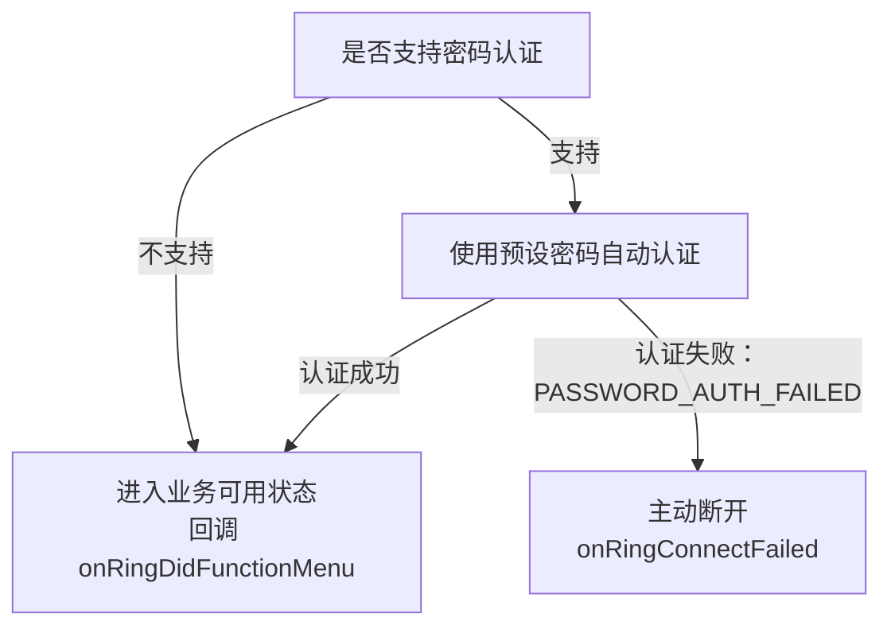

# RW BLE Android SDK使用说明文档

## 1. 简介

本文档主要对SDK里所提供的功能接口与使用场景进行解释说明。

此文档仅适用于RW公司的蓝牙设备.

#### 1.1 适用平台与语言

- Android8.0及以上, 语言Kotlin.

#### 1.2 相关术语

-  App: 本⽂指的是⼿机端或平板电脑上运⾏的应⽤程序;
-  设备: 本⽂指的是可穿戴式硬件设备:如⼿表,戒指等;
-  上传: 指的是设备向App发送数据;
-  下发: 指的是App向设备发送数据;

#### 1.3 注意事项

1. 使用此SDK时最好结合示例工程 `RW_SDK_DEMO` 使用; 参考例子只需关注NewMainActivity与ScanActivity两个页面代码即可.

2. `DHBleSdk` 大部分指令操作都是通过 订阅相应回调来实现 `DHBleSdk.subscribeData()`; 当不再使用时,请进行取消订阅`DHBleSdk.dispose()`;

   

## 2. 快速开始（Quick Start）

**第1步: 获取最新版本的Android Studio**

要想使用 RW BLE SDK for Android 开发项目，您需要安装Android Studio.

**第2步: 手动部署添加依赖库**

1. 导入aar到项目build.gradle里

```groovy
implementation files('libs/blesdk_rwfit_release_260130.aar')
```


**第3步: 需手机开启蓝牙并请求蓝牙与定位权限**

```kotlin
    private fun getBluePermissions(): List<String> {
        val permissions = mutableListOf<String>()
        permissions += Permission.BLUETOOTH_SCAN
        permissions += Permission.BLUETOOTH_ADVERTISE
        permissions += Permission.BLUETOOTH_CONNECT
        permissions += Permission.ACCESS_COARSE_LOCATION
        permissions += Permission.ACCESS_FINE_LOCATION
        return permissions
    }
```

**第4步: 初始化SDK**

```kotlin
DHBleSdk.initSDK(this)
```

> [!CAUTION]
>
> 会默认保存蓝牙部分日志文件, 保存在 `Data/appid(com.xxx.xxx)/logger/devices/`文件夹下.  可`XLogUtils.setLogEnable(false)`关闭.


**SDK 混淆说明**

Release AAR 已对 SDK 内部实现进行混淆，并已内置用于保留公开 API 的消费者混淆规则。通过 Gradle 正常引入 AAR 时，这些规则会自动合并到应用的 R8/ProGuard 配置中，一般不需要额外配置。

如果使用了会丢失 AAR 消费者混淆规则的二次打包方式，请在应用的 ProGuard 配置中增加以下规则：

```proguard
-keepattributes Signature,*Annotation*,InnerClasses,EnclosingMethod

-keep class com.example.blesdk.DHBleSdk { *; }

-keep class com.example.blesdk.ble.** { *; }
-keep class com.example.blesdk.rwbaselibrary.HandlerCallback { *; }

-keep class com.example.blesdk.bean.** { *; }
-keep class com.example.blesdk.callback.** { *; }

-keep class com.example.blesdk.blering.BaseDataCallback { *; }
-keep class com.example.blesdk.blering.DeviceDataCallback { *; }
-keep class com.example.blesdk.blering.BaseAnswerCallback { *; }
-keep class com.example.blesdk.blering.RingConnectBleCallback { *; }
-keep class com.example.blesdk.blering.RingBleError { *; }

-keep class com.example.blesdk.utils.** { *; }
```


## 3. 接口说明（API Reference）

### 3.1 设备搜索与连接, 绑定与重连

##### 3.1.1 搜索蓝牙

>  接口说明: 搜索蓝牙设备需使用`ScanBleService`先初始化并实现`ScanDeviceCallback`回调接口;

```kotlin
// 1. 初始化并注册回调
ScanBleService.getService().initBle(this)
ScanBleService.getService().registerScanBleCallback(this)

// 2. 开始搜索
ScanBleService.getService().startScan(true,null)

//3. ScanDeviceCallback接口会回调搜索到的蓝牙设备
public interface ScanDeviceCallback {
  public void onScanDevice(BleDevice device);
  public void onScanFinish();
  public void onError(int errorCode,Exception e);
}

//4. 取消注册回调
ScanBleService.getService().unRegisterScanBleCallback()
```

##### 3.1.2 停止搜索

> 接口说明: 停止搜索蓝牙设备

```kotlin
ScanBleService.getService().stopScan()
```


##### 3.1.3 连接设备与状态监听

> 接口说明: 连接指定设备,并监听设备连接状态.

```kotlin
// 1. 初始化并注册回调
DHBleSdk.setConnectBleCallback(this)

// 2. 连接设备
DHBleSdk.connectDeviceWithModel(bleDevice)

// 3. 实现并回调蓝牙连接状态
interface RingConnectBleCallback {
  fun onRingConnecting(device: BleDevice?)
  fun onRingConnected(device: BleDevice?)
  fun onRingConnectFailed(device: BleDevice?, reason: RingBleError = RingBleError.UNKNOWN)

  fun onRingDidFunctionMenu(device: BleDevice?, supportMenuBean: SupportMenuBean)
}
```

`RingConnectBleCallback` 接口说明:

| 方法                  | 说明                                                 |
| :-------------------- | ---------------------------------------------------- |
| onRingConnecting      | 连接中                                               |
| onRingConnected       | connectDeviceWithModel后,连接成功会返回.             |
| onRingConnectFailed   | 连接失败或断开会回调；密码认证失败时 `reason` 为 `PASSWORD_AUTH_FAILED` |
| onRingDidFunctionMenu | 成功获取设备配置表后会返回;业务操作应该在此之后操作. |

>  [!TIP]
>
> 连接后, 业务操作应该在`onRingDidFunctionMenu`之后才进行操作.


##### 3.1.4 断开连接设备

> 接口说明: 断开正在连接的设备,并监听设备连接状态

```kotlin
 DHBleSdk.disconnect()
```

##### 3.1.5 本地绑定与自动重连,解绑

> [!IMPORTANT]
>
> Android本地绑定,自动重连需自行实现, 本SDK不提供此功能;可以连接成功后,保存Mac地址,需要的配置表信息,方便页面显示与重连.


##### 3.1.6 设备功能配置表

>  [!IMPORTANT]
>
> 因设备型号多, 支持的功能不同,所以引入功能表信息,可查询设备功能支持情况. 具体参考SupportMenuBean类. 可根据业务自行保存功能表内容. 

`  fun onRingDidFunctionMenu(supportMenuBean:SupportMenuBean)`

DeviceFuncV2Model类属性定义:

| SupportMenuBean属性         | 说明                     |
| --------------------------- | ------------------------ |
| isPushMsgEnableSwitch       | 是否启用消息控制开关     |
| pushMsgSwitchValue          | 消息类型支持能力低32位（bit0-bit31） |
| pushMsgSwitchValue2         | 消息类型支持能力高32位（bit32-bit63），旧设备默认为0 |
| activityDataInterval        | 当天计步明细间隔（分钟）；未配置时按60处理 |
| isAlarm                     | 是否支持闹钟             |
| isBrightScreenSleepTime     | 是否支持屏幕睡眠时间设置 |
| isBrightScreenTime          | 是否支持亮屏时长         |
| isNewSport                  | 是否支持多运动;          |
| isRememberSwitch            | 是否支持Muslim赞念开关   |
| isSupportHrReminder         | 是否支持HR报警提示功能   |
| isSupportBoReminder         | 是否支持SP02报警提示功能 |
| isSupportMotoVibrationLevel | 是否支持马达震动提醒     |
| isSupportAlarmVibrationDuration | 是否支持闹钟震动时长设置 |
| isSupportVibrationInterval  | 是否支持震动间隔时长设置 |
| isStep                      | 是否支持计步             |
| isHr                        | 是否支持心率             |
| isBloodPress                | 是否支持血压             |
| isSleep                     | 是否支持睡眠             |
| isBloodOxy                  | 是否支持血氧             |
| isHrv                       | 是否支持心率变异性       |
| isPressure                  | 是否支持压力             |
| isBloodSugar                | 是否支持血糖             |
| isMuslimCountData           | 是否支持赞念             |
| isDataTypeTemperature       | 是否支持体温             |
| isSupportMuslimTimeDisplayMode | 是否支持Muslim时间显示模式 |
| isSupportSensorRawPPG       | 是否支持获取PPG原始数据   |
| isSupportPPGMonitoring      | 是否支持PPG定时监测       |
| isSupportTemperatureMonitoring | 是否支持温度定时监测    |
| isSupportCountReminder      | 是否支持计数提醒间隔设置 |
| isSupportSensorRawACC       | 是否支持获取ACC原始数据   |
| isSupportSensorRawPPGRed    | 是否支持获取PPG Red原始数据 |
| isSupportSensorRawIR        | 是否支持获取IR红外原始数据  |
| isSupportSensorRawSleep     | 是否支持睡眠实时数据       |
| isSupportFallDetect         | 是否支持跌落提醒           |
| isSupportRecording          | 是否支持录音功能           |
| isSupportDevicePasswordAuth | 是否支持设备密码认证       |


### 3.2 设备功能操作

#### 3.2.1 基础功能指令接口

##### 3.2.1.1 Get SDK Version

> 获取SDK版本号.

方法说明: 

`DHBleSdk.getSDKVersion()`

调用示例:

```kotlin
Log.e("RWSDK", DHBleSdk.getSDKVersion())
```

##### 3.2.1.2 设置用户信息

> 用户信息设置与计步卡路里,距离有关; 设备初始化时性别为1, 年龄 18, 身高170cm, 体重 65 kg.
>
> 订阅 `CommonStatusCallback` 获取结果.

方法说明: 

`fun setUserInfo(personBean: PersonBean)`

参数说明:

| 参数       | 类型       | 说明 | 值                                                           |
| ---------- | ---------- | ---- | ------------------------------------------------------------ |
| personBean | PersonBean | 类   | gender: 性别（0.女 1.男)<br>height: 身高cm,浮点型<br>weight: 体重kg,浮点型<br/>age: 年龄 |

调用示例:

```kotlin
DHBleSdk.subscribeStatus(object : CommonStatusCallback{
  override fun onSuccess(id: Int) {
    Log.e("RWSDK", "user info set ok")
  }

  override fun onFail(id: Int, errorCode: Int) {
    Log.e("RWSDK", "user info set failed")
  }

})


val persionBean = PersonBean()
persionBean.measureUnit = 0
persionBean.gender = 1
persionBean.height = 170.5f
persionBean.weight = 80f
persionBean.age = 20
DHBleSdk.setUserInfo(persionBean)
```


##### 3.2.1.3 获取设备信息

> 获取设备型号、固件版本号、屏幕信息和UI版本号.
>
> 订阅 `FirmwareCallback` 获取结果.

方法说明:

`fun getFirmwareVersionJL()`

返回说明:

| FirmVersionBean属性 | 类型   | 说明                         |
| ------------------- | ------ | ---------------------------- |
| deviceClazz         | String | 设备型号, 每个型号产品的唯一标识 |
| deviceNo            | String | 固件版本号                   |
| screenType          | int    | 屏幕类型: 0.方屏 1.圆屏      |
| screenWidth         | int    | 屏幕宽度                     |
| screenHeight        | int    | 屏幕高度                     |
| uiVersion           | String | UI版本号                     |

> **注意:** 升级固件前必须校验设备的 `deviceClazz` 与升级固件对应的设备型号是否一致, 只有型号一致时才能进行升级, 型号不一致时禁止升级.

调用示例:

```kotlin
DHBleSdk.subscribeData(object : FirmwareCallback {
  override fun onSuccess() {
  }

  override fun onFail(errorCode: Int) {
    Log.e("RWSDK", "firmware info get failed, errorCode=$errorCode")
  }

  override fun onResult(data: FirmVersionBean?) {
    data?.let {
      Log.e("RWSDK", "firmware info --> $it")
    }
  }
})

DHBleSdk.getFirmwareVersionJL()
```


##### 3.2.1.4 获取电量

> APP获取设备的电量信息.
>
> 订阅 `PowerCallback` 获取结果.

方法说明:

`fun getPowerJL()`

返回说明:

| PowerBean属性 | 类型 | 说明                |
| ------------- | ---- | ------------------- |
| power         | int  | 剩余电量, 范围0-100 |

调用示例:

```kotlin
DHBleSdk.subscribeData(object : PowerCallback {
  override fun onSuccess() {
  }

  override fun onFail(errorCode: Int) {
    Log.e("RWSDK", "power get failed, errorCode=$errorCode")
  }

  override fun onResult(data: PowerBean?) {
    data?.let {
      Log.e("RWSDK", "power --> $it")
    }
  }
})

DHBleSdk.getPowerJL()
```


##### 3.2.1.5 获取与设置视频控制开关

> 设置是否开启戒指手势控制刷视频; <u>此功能需配对蓝牙HID.</u> HID配对可使用 `BlueToothUtils createOrRemoveBond` (type 1 匹配  2  取消匹配) 进行配对HID, 也可自行实现.
>
> 订阅 `videoHidCallback` 获取结果.

方法说明:

`fun setVideoHidJL(videoHidBean: VideoHidBean)`

参数说明:

| 参数         | 类型         | 说明 | 值                                           |
| ------------ | ------------ | ---- | -------------------------------------------- |
| videoHidBean | VideoHidBean | 类   | hidOpen: 0.关闭 1.视频打开 2. boook 3. music |

调用示例:

```kotlin
//设置视频控制开关
DHBleSdk.subscribeData(videoHidCallback)
val videoHidBean = VideoHidBean()
videoHidBean.hidOpen = 1  //Whether to open short video control
DHBleSdk.setVideoHidJL(videoHidBean)

// 获取视频控制开关
DHBleSdk.subscribeData(videoHidCallback)
DHBleSdk.getVideoHidJL()
```

##### 3.2.1.6 获取与设置LED亮屏强度

> 配置表属性: `isLEDLight` ;
>
> 订阅 `BrightLedLevelCallback` 获取结果.

方法说明:

`fun setRingLedLevel(brightScreenBean: BrightScreenLedBean)`

参数说明:

| 参数             | 类型                | 说明 | 值                                                           |
| ---------------- | ------------------- | ---- | ------------------------------------------------------------ |
| brightScreenBean | BrightScreenLedBean | 类   | isOpen: false为off,ture为(1-3Level)<br>lcdLevel: 1微光, 2柔光, 3强光 |

调用示例:

```kotlin
// 获取LED亮屏强度
DHBleSdk.subscribeData(brightLedLevelCallback)
DHBleSdk.getRingLedLevel()

//设置LED亮屏强度
DHBleSdk.subscribeData(brightLedLevelCallback)
val tBrightScreenLedBean = BrightScreenLedBean()
tBrightScreenLedBean.isOpen = true //false为off,ture为(1-3Level)
tBrightScreenLedBean.lcdLevel = 3 //1-3Level: 1 low 2 mid 3 high
DHBleSdk.setRingLedLevel(tBrightScreenLedBean)
```


##### 3.2.1.7 获取与设置佩戴位置

> 获取或设置戒指的佩戴位置.
>
> 配置表属性: `isWearDir`.
>
> 订阅 `WearHandCallback` 获取结果.

方法说明:

`fun getRingWearDir()`

`fun setRingWearHand(isOpen: Boolean)`

参数说明:

| 参数   | 类型    | 说明     | 值                    |
| ------ | ------- | -------- | --------------------- |
| isOpen | Boolean | 佩戴位置 | false.左手 true.右手  |

返回说明:

| FactoryInBean属性 | 类型 | 说明                     |
| ----------------- | ---- | ------------------------ |
| isOpen            | int  | 佩戴位置: 0.左手 1.右手  |

调用示例:

```kotlin
val wearHandCallback = object : WearHandCallback {
  override fun onSuccess() {
    Log.e("RWSDK", "wear hand operation success")
  }

  override fun onFail(errorCode: Int) {
    Log.e("RWSDK", "wear hand operation failed, errorCode=$errorCode")
  }

  override fun onResult(data: FactoryInBean?) {
    data?.let {
      Log.e("RWSDK", "wear hand=${it.isOpen()}")
    }
  }
}

DHBleSdk.subscribeData(wearHandCallback)

// 获取佩戴位置
DHBleSdk.getRingWearDir()

// 设置为左手佩戴
DHBleSdk.setRingWearHand(false)

// 设置为右手佩戴
DHBleSdk.setRingWearHand(true)
```


##### 3.2.1.8 启动与关闭拍照

> APP进入自定义相机页面时开启拍照控制, 开启后设备可通过手势通知APP执行拍照; APP退出相机页面时关闭拍照控制.
>
> 配置表属性: `isTakePhoto`.
>
> 订阅 `TakePhotoCallback` 接收设备发出的拍照通知.

方法说明:

`fun controlTakePhotoJL(controlType: Int)`

参数说明:

| 参数        | 类型 | 说明     | 值                  |
| ----------- | ---- | -------- | ------------------- |
| controlType | Int  | 拍照控制 | 0.关闭拍照 1.开启拍照 |

返回说明:

| 回调数据 | 类型 | 说明                     |
| -------- | ---- | ------------------------ |
| data     | Int  | 2.设备通知APP执行拍照     |

调用示例:

```kotlin
private val takePhotoCallback = object : TakePhotoCallback {
  override fun onSuccess() {
    Log.e("RWSDK", "take photo control success")
  }

  override fun onFail(errorCode: Int) {
    Log.e("RWSDK", "take photo control failed, errorCode=$errorCode")
  }

  override fun onResult(data: Int?) {
    if (data == 2) {
      // 设备发出拍照通知, APP在此执行自定义相机拍照
    }
  }
}

// APP进入相机页面时调用
fun onCameraPageOpened() {
  DHBleSdk.subscribeData(takePhotoCallback)
  DHBleSdk.controlTakePhotoJL(1)
}

// APP退出相机页面时调用
fun onCameraPageClosed() {
  DHBleSdk.controlTakePhotoJL(0)
  DHBleSdk.dispose(takePhotoCallback)
}
```

##### 3.2.1.9 查找设备

> 调用查找后设备灯或屏幕会亮.

方法说明:

`fun controlFindDeviceJL()`

调用示例:

```kotlin
DHBleSdk.controlFindDeviceJL()
```

##### 3.2.1.10 关机,恢复出厂设置

> 订阅 `DeviceControlCallback` 获取结果.

方法说明:

`fun setPowerOffJL(type: Int)`

参数说明:

| 参数 | 类型 | 说明 | 值                                                           |
| ---- | ---- | ---- | ------------------------------------------------------------ |
| type | Int  | 整形 | 关机: Constants.CONTROL_DEVICE_POWER_OFF<br>恢复出厂: Constants.CONTROL_DEVICE_RECOVERY |

调用示例:

```kotlin
// 关机
DHBleSdk.setPowerOffJL(Constants.CONTROL_DEVICE_POWER_OFF) //Shutdown (关机)

// 恢复出厂
DHBleSdk.setPowerOffJL(Constants.CONTROL_DEVICE_RECOVERY) //Factory Reset(恢复出厂)

//可订阅subscribe DeviceControlCallback回调
```

##### 3.2.1.11 闹钟

###### 3.2.1.11.1 获取已设置闹钟

> 配置表属性: `isAlarm` 
>
> 订阅`AlarmCallback`回调;

方法说明:

`DHBleSdk.getAlarmRemindJL();`

调用示例:

```kotlin
//获取设备里已保存的闹钟
DHBleSdk.subscribeData(alarmCallback)
DHBleSdk.getAlarmRemindJL()
```


###### 3.2.1.11.2 设置闹钟

> **当前协议不支持单独修改闹钟，任何单个闹钟的开关或删除操作，均需重新下发全部闹钟配置。**
>
> 订阅`AlarmCallback`回调;

方法说明:

`fun setAlarmRemindJL(reminderBeans: List<AlarmRemainderBean>)`

参数说明:

| 参数          | 类型                     | 说明     | 值                                                           |
| ------------- | ------------------------ | -------- | ------------------------------------------------------------ |
| reminderBeans | List<AlarmRemainderBean> | 闹钟数组 | isOpen: true开/false关<br>repeatModel: IntArray(7)周日至周六,要重复的对应置1<br>startHour: 闹钟开始时<br>startMin: 闹钟开始分<br>alarmTag: 设置为空字符串; |

调用示例:

```kotlin
//设置闹钟        
DHBleSdk.subscribeData(alarmCallback)

val params = mutableListOf<AlarmRemainderBean>()
val alarmRemainderBean = AlarmRemainderBean()
alarmRemainderBean.alarmTag = ""
alarmRemainderBean.repeatModel = IntArray(7) //单次；周日至周六,要重复的对应置1
alarmRemainderBean.startHour = 7
alarmRemainderBean.startMin = 0
alarmRemainderBean.isOpen = true
alarmRemainderBean.alarmId = 0
params += alarmRemainderBean

val alarmRemainderBean2 = AlarmRemainderBean()
alarmRemainderBean2.alarmTag = ""
alarmRemainderBean2.repeatModel = IntArray(7) //单次；周日至周六,要重复的对应置1
alarmRemainderBean2.startHour = 8
alarmRemainderBean2.startMin = 0
alarmRemainderBean2.isOpen = false
alarmRemainderBean2.alarmId = 0
params += alarmRemainderBean2

DHBleSdk.setAlarmRemindJL(params)
```


###### 3.2.1.11.3 删除所有闹钟

> `DHBleSdk.deleteAllAlarmRemindJL`;
>
> 订阅`AlarmCallback`回调;

方法说明:

`DHBleSdk.deleteAllAlarmRemindJL`

```kotlin
//订阅回调        
DHBleSdk.subscribeData(alarmCallback)
//删除所有闹钟
DHBleSdk.deleteAllAlarmRemindJL()
```

##### 3.2.1.12 震动次数设置与获取

> 配置表属性: `isSupportMotoVibrationLevel` 
>
> 设备震动次数; 
>
> 订阅`VibrationCountCallback`回调.

方法说明: 

`fun setVibrationCount(level:Int, count: Int)`

`fun getVibrationCount()`

参数说明:

| 参数  | 类型 | 说明 | 值                                                        |
| ----- | ---- | ---- | --------------------------------------------------------- |
| level | Int  | 整形 | 震动强度, 0:关闭 1:低 2: 中 3: 高; *未定义此功能的可忽略* |
| count | Int  | 整形 | 震动次数可以被设置(0-6次)，初始默认2次.设置0次不震动      |

调用示例:

```kotlin
//设置 
DHBleSdk.subscribeData(vibrationCountCallback)
DHBleSdk.setVibrationCount(1, 2) //震动次数2次

//获取
DHBleSdk.subscribeData(vibrationCountCallback)
DHBleSdk.getVibrationCount()
```


##### 3.2.1.13 屏幕睡眠模式设置与获取

>  设置屏幕睡眠开启与时间;
>
>  配置表属性:  `isBrightScreenSleepTime`
>
>  订阅 `BrightTimeCallback` 获取结果.

方法说明: 

`fun setRingBrightScreenSleepTime(briScreenTime: BrightScreenTimeBean)`

`fun getRingBrightScreenSleepTime()`

参数说明:

| 参数                 | 类型 | 说明 | 值                                                           |
| -------------------- | ---- | ---- | ------------------------------------------------------------ |
| BrightScreenTimeBean | 类   |      | isOpen, 开关打开YES或关闭NO<br>startHour, 开始时间小时<br>startMin,开始时间分钟<br>endHour,结束时间小时<br>endMin,结束时间分钟 |

调用示例:

```kotlin
//订阅
DHBleSdk.subscribeData(brightTimeCallback)

//设置 
val briScreenTime = BrightScreenTimeBean()
briScreenTime.isOpen = true
briScreenTime.startHour = 20 //晚上8点至早上8点睡眠
briScreenTime.startMin = 0
briScreenTime.endHour = 8
briScreenTime.endMin = 0

DHBleSdk.setRingBrightScreenSleepTime(briScreenTime)

//获取
DHBleSdk.getRingBrightScreenSleepTime()
```

##### 3.2.1.14 消息与来电

###### 3.2.1.14.1 消息推送

>  APP主动向设备推送消息通知(非ANCS), 消息开关由APP自行控制.

方法说明: 

`fun setPushMsgJL(msgPushBean: MsgPushBean)`

参数说明:

| 参数        | 类型 | 说明 | 值                  |
| ----------- | ---- | ---- | ------------------- |
| MsgPushBean | 类   |      | 见MsgPushBean类定义 |

调用示例:

```kotlin
val messageBean = MsgPushBean()
messageBean.appId = "com.ten.wenxin"
messageBean.title = "1111"
messageBean.content = "8888"
DHBleSdk.setPushMsgJL(messageBean)
```

###### 3.2.1.14.2 来电控制

> 设备端触发接听或挂断来电时, APP需监听设备指令并执行对应电话操作.

方法说明:

`fun controlPhoneJL(controlType: Int)`

参数说明:

| 参数        | 类型 | 说明         | 值                       |
| ----------- | ---- | ------------ | ------------------------ |
| controlType | Int  | 来电控制类型 | 0: 接听<br>1: 挂断      |

调用示例:

```kotlin
// 接听来电
DHBleSdk.controlPhoneJL(0)

// 挂断来电
DHBleSdk.controlPhoneJL(1)
```

###### 3.2.1.14.3 音乐控制

> 设备端触发音乐控制(播放/暂停/上一曲/下一曲等)时, APP需监听设备指令并执行对应操作.
>
> 订阅 `MusicPushSettingCallback` 接收设备音乐控制事件.

MusicPushSettingCallback 返回值说明:

| 值   | 说明     |
| ---- | -------- |
| 1    | 播放     |
| 2    | 暂停     |
| 3    | 上一曲   |
| 4    | 下一曲   |
| 5    | 音量加   |
| 6    | 音量减   |

调用示例:

```kotlin
DHBleSdk.subscribeData(object : MusicPushSettingCallback {
    override fun onResult(data: Int?) {
        when (data) {
            1 -> { /* 播放 */ }
            2 -> { /* 暂停 */ }
            3 -> { /* 上一曲 */ }
            4 -> { /* 下一曲 */ }
            5 -> { /* 音量加 */ }
            6 -> { /* 音量减 */ }
        }
    }
    override fun onFail(errorCode: Int) {}
    override fun onSuccess() {}
})
```

##### 3.2.1.15 获取与设置赞念是否打开

>  设置赞念功能是否打开;
>
>  配置表属性:  `isRememberSwitch`
>
>  订阅 `MuslimCountSwitchCallback` 获取结果.

方法说明: 

`fun deviceRememberSwitch(status: Int)`

`fun deviceRememberSwitchGet()`

参数说明:

| 参数   | 类型 | 说明 | 值                 |
| ------ | ---- | ---- | ------------------ |
| status | Int  |      | 0: 关闭<br>1: 打开 |

调用示例:

```kotlin
//设置 
DHBleSdk.subscribeData(muslimCountSwitchCallback)
DHBleSdk.deviceRememberSwitch(1)

//获取
DHBleSdk.deviceRememberSwitchGet()

```


##### 3.2.1.16 获取与设置心率/血氧报警配置

>  设置心率与血氧通知报警数据功能; 报警提示会通过 `HrBoActualReminderCallback` 实时通知出来.
>
>  配置表属性:  `isSupportHrReminder`
>
>  订阅 `HrReminderCallback` , `BoReminderCallback` 获取结果.

方法说明: 

`fun deviceGetHrAlertCmd()`

`fun deviceSetHrAlertCmd(status: Int, value: Int, underValue:Int)`


`fun deviceGetBoAlertCmd()`

`fun deviceSetBoAlertCmd(status: Int, value: Int)`

参数说明:

| 参数       | 类型 | 说明 | 值                                                           |
| ---------- | ---- | ---- | ------------------------------------------------------------ |
| status     | Int  |      | 1: 开, <br>0: 关;<br>overValue: 报警值, 默认值为 心率超过160，血氧低于94%， |
| value      | Int  |      | 超出报警值, 默认值为 心率超过160                             |
| underValue | Int  |      | 低于设置值报警; 如果获取到为0xff,代表不支持此项功能;         |

**注意: 通过 deviceGetHrAlertCmd()获取如果underValue为0xff,代表不支持此项功能. **

实时报警返回值HrBoActualReminderBean说明:

| HrBoActualReminderBean参数 | 类型 | 说明 | 值                                                   |
| -------------------------- | ---- | ---- | ---------------------------------------------------- |
| type                       | Int  |      | 0: 心率超出报警, <br>1: 血氧报警;<br>2: 心率低于报警 |
| remindValue                | Int  |      | 报警值                                               |

调用示例:

```kotlin
//设置 
DHBleSdk.subscribeData(hrReminderCallback)
DHBleSdk.deviceSetHrAlertCmd(1, 140, 0xff)

//获取
DHBleSdk.subscribeData(hrReminderCallback)
DHBleSdk.deviceGetHrAlertCmd()


//报警结果通知推送
DHBleSdk.subscribeData(hrBoActualReminderCallback) //Alert Message

private val hrBoActualReminderCallback by lazy {
  object : HrBoActualReminderCallback{
    override fun onResult(data: HrBoActualReminderBean) {
      Log.e("RWSDK", "output: HrBoActualReminderCallback data " + data.type + " value " + data.remindValue)
      if (data.type == 0){ // HR Over Value Alarm

      }
      else if (data.type == 1){// SP02 Over Value Alarm

      }
      else if (data.type == 2){// HR Under Value Alarm

      }
    }

    override fun onFail(errorCode: Int) {
      Log.e("RWSDK", "output: HrBoActualReminderCallback errorCode " + errorCode)
    }

    override fun onSuccess() {
      Log.e("RWSDK", "output: HrBoActualReminderCallback onSuccess")
    }

  }
}
```


##### 3.2.1.17 获取与设置亮屏时长

>  配置表属性:  `isBrightScreenTime`
>
>  订阅 `BrightTimeCallback` 获取结果.

方法说明: 

`fun getBrightScreenTimeJL()`

`fun setBrightScreenTimeJL(briScreenTime: BrightScreenTimeBean)`

参数说明:

| BrightScreenTimeBean参数 | 类型   | 说明                                         | 值   |
| ------------------------ | ------ | -------------------------------------------- | ---- |
| timeSecond               | Int    | 亮屏时长,秒(s), 范围0-30s;                   |      |
| durationNums             | String | 设备支持的时长值, 获取到如果有值,以逗号隔开; |      |


调用示例:

```kotlin
//设置 
val briScreenTime = BrightScreenTimeBean()
briScreenTime.timeSecond = 10 //亮屏10s
DHBleSdk.subscribeData(brightTimeCallback)
DHBleSdk.setBrightScreenTimeJL(briScreenTime)

//获取
DHBleSdk.getBrightScreenTimeJL()

```


##### 3.2.1.18 获取与设置抬腕亮屏时长

>  配置表属性:  `isRaiseBrightScreen`
>
>  订阅 `BrightCallback` 获取结果.

方法说明: 

`fun getRaiseBrightScreenJL()`

`fun setRaiseBrightScreenJL(brightScreenBean: BrightScreenBean)`

参数说明:

| BrightScreenBean参数 | 类型 | 说明                   | 值   |
| -------------------- | ---- | ---------------------- | ---- |
| isOpen               | Int  | true:开启; false: 关闭 |      |
| startHour            | Int  | 开始时间小时           |      |
| startMin             | Int  | 开始时间分钟           |      |
| endHour              | Int  | 结束时间小时           |      |
| endMin               | Int  | 结束时间分钟           |      |


调用示例:

```kotlin
//设置 
val rasieScreenTime = BrightScreenBean()
rasieScreenTime.isOpen = true
rasieScreenTime.startHour = 8 //早上8点至晚上8点 抬腕亮屏
rasieScreenTime.startMin = 0
rasieScreenTime.endHour = 20
rasieScreenTime.endMin = 0
DHBleSdk.subscribeData(raiseBrightTimeCallback)
DHBleSdk.setRaiseBrightScreenJL(rasieScreenTime)

//获取
DHBleSdk.getRaiseBrightScreenJL()

```


##### 3.2.1.19 设置时间格式12/24小时制

>  带屏显示时间的设备才有效.
>
>  订阅 `CommonStatusCallback` 获取结果.

方法说明: 

`fun ringSetTimeformat(type: Int)`

参数说明:

| 参数       | 类型 | 说明                       |      |
| ---------- | ---- | -------------------------- | ---- |
| timeformat | Int  | 0: 24小时制<br>1: 12小时制 |      |

调用示例:

```kotlin
DHBleSdk.subscribeStatus(object : CommonStatusCallback{
  override fun onSuccess(id: Int) {
    Log.e("RWSDK", "time format set ok")
  }

  override fun onFail(id: Int, errorCode: Int) {
    Log.e("RWSDK", "time format set failed")
  }
})
DHBleSdk.ringSetTimeformat(0)

```


##### 3.2.1.20 闹钟震动时长设置与获取

> 设置闹钟震动次数;
>
> 配置表属性: `isSupportAlarmVibrationDuration`
>
> 订阅 `AlarmVibrationDurationCallback` 获取结果.

方法说明:

`fun setAlarmVibrationDuration(count: Int)`

`fun getAlarmVibrationDuration()`

参数说明:

| 参数  | 类型 | 说明 | 值                                       |
| ----- | ---- | ---- | ---------------------------------------- |
| count | Int  | 整形 | 震动次数(0-6), 默认2次, 设置0次为不震动 |

调用示例:

```kotlin
//设置
DHBleSdk.subscribeData(alarmVibrationDurationCallback)
DHBleSdk.setAlarmVibrationDuration(2) //2次

//获取
DHBleSdk.subscribeData(alarmVibrationDurationCallback)
DHBleSdk.getAlarmVibrationDuration()
```


##### 3.2.1.21 触摸事件通知

> 设备触摸事件通知, 设备主动上报. 触摸操作无论熄屏与否都会上报, 由APP定义响应行为.
>
> 订阅 `TouchEventCallback` 接收触摸事件.
>
> **提示:** 此功能为设备端定制功能, 使用前请确认设备厂家已在固件中集成并启用; 未定制或未启用时, APP无法收到触摸事件通知.

TouchEventCallback 返回 int[] 数据说明:

| 索引 | 说明     | 值                                                    |
| ---- | -------- | ----------------------------------------------------- |
| [0]  | 按键类型 | 1: 触摸按键(默认), 2: 跌落(需开启跌落提醒3.2.1.24)    |
| [1]  | 触摸类型 | 1: 单击, 2: 双击, 3: 三击, 4: 长按, 5: 甩动. <br>按键类型为2(跌落)时, 触摸类型默认为1 |

调用示例:

```kotlin
//在onCreate中订阅
DHBleSdk.subscribeData(touchEventCallback)

private val touchEventCallback by lazy {
    object : TouchEventCallback {
        override fun onResult(data: IntArray?) {
            data?.let {
                val keyType = it[0]   // 1:触摸按键
                val touchType = it[1] // 1:单击 2:双击 3:三击 4:长按 5:甩动
                Log.e("RWSDK", "TouchEvent keyType=$keyType touchType=$touchType")
            }
        }
        override fun onFail(errorCode: Int) {}
        override fun onSuccess() {}
    }
}
```


##### 3.2.1.22 震动间隔时长设置与获取

> 设置每次震动之间的间隔时间, 用于调节震动节奏;
>
> 配置表属性: `isSupportVibrationInterval`
>
> 订阅 `VibrationIntervalCallback` 获取结果.

方法说明:

`fun setVibrationInterval(intervalMs: Int)`

`fun getVibrationInterval()`

参数说明:

| 参数       | 类型 | 说明 | 值                                          |
| ---------- | ---- | ---- | ------------------------------------------- |
| intervalMs | Int  | 整形 | 间隔时长(100-1000ms), 默认500ms |

调用示例:

```kotlin
//设置
DHBleSdk.subscribeData(vibrationIntervalCallback)
DHBleSdk.setVibrationInterval(500) //500ms

//获取
DHBleSdk.subscribeData(vibrationIntervalCallback)
DHBleSdk.getVibrationInterval()
```


##### 3.2.1.23 心率校正(工厂测试)

> 启动设备心率校正模式. 发送校正指令后, 设备会返回两条数据:
>
> 第1条 result=0 表示校正中; 第2条 result非0 表示校正完成.
>
> 订阅 `FactoryTestCallback` 获取返回结果, onResult 返回 long[]: [0]=testMode, [1]=result.

方法说明:

`fun startFactoryTest(testMode: Int)`

参数说明:

| 参数     | 类型 | 说明     | 值                |
| -------- | ---- | -------- | ----------------- |
| testMode | Int  | 测试模式 | 0x15: 心率校正    |

调用示例:

```kotlin
DHBleSdk.subscribeData(factoryTestCallback)
DHBleSdk.startFactoryTest(0x15)

private val factoryTestCallback by lazy {
    object : FactoryTestCallback {
        override fun onResult(data: LongArray?) {
            data?.let {
                if (it[1] == 0L) {
                    Log.e("RWSDK", "HR calibrating...")
                } else {
                    Log.e("RWSDK", "HR calibration done, result=${it[1]}")
                }
            }
        }
        override fun onFail(errorCode: Int) {}
        override fun onSuccess() {}
    }
}
```


##### 3.2.1.24 跌落提醒设置

> 设置或获取跌落提醒开关. 开启后设备检测到跌落时会通过触摸事件通知(3.2.1.21)上报.
>
> 跌落事件通过 `TouchEventCallback` 返回, 按键类型(keyType)=2 表示跌落事件.
>
> 配置表属性: `isSupportFallDetect`
>
> 订阅 `FallDetectCallback` 获取设置/获取结果.

方法说明:

`fun setFallDetect(enable: Boolean)`

`fun getFallDetect()`

参数说明:

| 参数   | 类型    | 说明         | 值                |
| ------ | ------- | ------------ | ----------------- |
| enable | Boolean | 开关         | true: 开, false: 关 |

调用示例:

```kotlin
//获取跌落提醒开关
DHBleSdk.subscribeData(fallDetectCallback)
DHBleSdk.getFallDetect()

//设置跌落提醒开启
DHBleSdk.subscribeData(fallDetectCallback)
DHBleSdk.setFallDetect(true)

private val fallDetectCallback by lazy {
    object : FallDetectCallback {
        override fun onResult(data: Int?) {
            Log.e("RWSDK", "FallDetect state: $data (0=off, 1=on)")
        }
        override fun onFail(errorCode: Int) {}
        override fun onSuccess() {}
    }
}
```


##### 3.2.1.25 计数提醒间隔设置

> 设置或获取计数提醒间隔. 开启后用户完成一次计数操作开始计时, 达到设定间隔后设备震动一次提醒继续计数.
>
> 配置表属性: `isSupportCountReminder`
>
> 订阅 `CountReminderIntervalCallback` 获取结果.

方法说明:

`fun setCountReminderInterval(intervalMinutes: Int)`

`fun getCountReminderInterval()`

参数说明:

| 参数            | 类型 | 说明     | 值                                       |
| --------------- | ---- | -------- | ---------------------------------------- |
| intervalMinutes | Int  | 间隔分钟 | 0: 关闭, 30/60/90/120: 提醒间隔(分钟) |

调用示例:

```kotlin
//获取计数提醒间隔
DHBleSdk.subscribeData(countReminderCallback)
DHBleSdk.getCountReminderInterval()

//设置计数提醒间隔60分钟
DHBleSdk.subscribeData(countReminderCallback)
DHBleSdk.setCountReminderInterval(60)

//关闭计数提醒
DHBleSdk.subscribeData(countReminderCallback)
DHBleSdk.setCountReminderInterval(0)

private val countReminderCallback by lazy {
    object : CountReminderIntervalCallback {
        override fun onResult(data: Int?) {
            Log.e("RWSDK", "CountReminderInterval: $data min (0=off)")
        }
        override fun onFail(errorCode: Int) {}
        override fun onSuccess() {}
    }
}
```


##### 3.2.1.26 设备密码认证

> 设备是否支持密码认证通过功能配置表属性 `isSupportDevicePasswordAuth` 判断。
>
> 密码为4位数字。传入 `null` 或空字符串时按默认密码 `0000` 处理。
>
> 支持密码认证的设备，认证成功后才回调 `onRingDidFunctionMenu`；认证失败时SDK主动断开，并返回 `RingBleError.PASSWORD_AUTH_FAILED`。不支持的设备沿用原连接流程。



###### 3.2.1.26.1 设置自动认证密码

`fun prepareAutoPassword(password: String?)`

> 设置SDK连接时自动认证使用的密码。可在SDK初始化后提前设置，但必须在连接设备前完成调用。

输入参数说明:

| 参数       | 类型     | 说明                                                  |
| ---------- | -------- | ----------------------------------------------------- |
| `password` | `String` | 4位数字密码；传入 `null` 或空字符串时按 `0000` 处理   |

返回回调说明:

| 回调方法                | 返回值                               | 说明                               |
| ----------------------- | ------------------------------------ | ---------------------------------- |
| `onRingDidFunctionMenu` | `SupportMenuBean`                    | 密码认证成功，设备进入业务可用状态 |
| `onRingConnectFailed`   | `RingBleError.PASSWORD_AUTH_FAILED`  | 密码认证失败，SDK会主动断开设备    |

调用示例:

```kotlin
DHBleSdk.setConnectBleCallback(this)
DHBleSdk.prepareAutoPassword("1234")
DHBleSdk.connectDeviceWithModel(bleDevice)

override fun onRingDidFunctionMenu(device: BleDevice?, supportMenuBean: SupportMenuBean) {
    Log.e("RWSDK", "Device ready")
}

override fun onRingConnectFailed(device: BleDevice?, reason: RingBleError) {
    if (reason == RingBleError.PASSWORD_AUTH_FAILED) {
        Log.e("RWSDK", "Device password authentication failed")
    }
}
```

###### 3.2.1.26.2 修改设备密码

`fun modifyDevicePwd(password: String?, callback: CustomStatusCallback)`

> 在设备已连接且密码认证成功后修改设备密码。正常解绑时，应先将设备密码修改为 `0000`，收到成功回调后再清除本地绑定并断开连接。

调用示例:

```kotlin
DHBleSdk.modifyDevicePwd("0000", object : CustomStatusCallback {
    override fun onSuccess() {
        //密码已恢复为0000，可继续处理本地解绑并断开设备。
        DHBleSdk.disconnect()
    }

    override fun onFail(errorCode: Int) {
        Log.e("RWSDK", "Modify password failed: $errorCode")
    }
})
```

#### 3.2.2 健康数据同步(实时单次与全天检测)

> 健康数据检测有两种方式: 实时单次检测与全天检测。健康数据包括心率,血氧,压力,HRV,睡眠等, **睡眠无实时检测**。 
>
> (1) 实时单次检测: APP侧启动设备进入单次检测,检测完后马上返回结果。
>
> (2) 全天检测: 可设置间隔时间,比如30分钟或60分钟设备会进行检测并保存值; **app一直不同步情况下,设备可保存3-6天的数据**。


##### 3.2.2.1 实时检测-启动与关闭设备健康数据检测

> 启动健康数据检测(心率,血氧,HRV,压力,血糖等); 
>
> 订阅`HealthDataBroCallback` 测试完成设备会通知app；
>
> 订阅`HealthDataControlCallback` 测试中实时值设备会通知app；

> [!CAUTION]
>
> 同一时间只能开启一种健康检测类型, 必须等当前检测结束(收到完成回调)或主动关闭后, 才能启动新的检测类型. 同时开启多种会导致检测异常.

方法说明:

`fun controlHealthDataJL(healthType: Byte, testStatus: Byte)`

参数说明:

| 参数       | 类型 | 说明         | 值                                                           |
| ---------- | ---- | ------------ | ------------------------------------------------------------ |
| healthType | Byte | 健康数据类型 | 心率: CmdConstants.JL_HR_DATA_TRANSFER_KEY<br>血氧: CmdConstants.JL_BO_DATA_TRANSFER_KEY<br>HRV: CmdConstants.JL_HRV_DATA_TRANSFER_KEY<br>压力: CmdConstants.JL_PRESSURE_DATA_TRANSFER_KEY<br>血糖: CmdConstants.JL_BLOODSUGAR_DATA_TRANSFER_KEY<br>血压: CmdConstants.JL_BP_DATA_TRANSFER_KEY<br>体温: CmdConstants.JL_TEMP_DATA_TRANSFER_KEY |
| testStatus | Byte | 启动/关闭    | 启动: 1<br>关闭: 0                                           |

调用示例:

```kotlin
//启动心率测试
DHBleSdk.subscribeData(healthDataBroCallback) //Monitor real-time health data return (监听实时健康数据返回)
DHBleSdk.subscribeData(testHrCallback) //Monitor control command results (监听控制指令结果)
DHBleSdk.controlHealthDataJL(CmdConstants.JL_HR_DATA_TRANSFER_KEY, 1)

//关闭心率测试
DHBleSdk.subscribeData(testHrCallback)
DHBleSdk.controlHealthDataJL(CmdConstants.JL_HR_DATA_TRANSFER_KEY, 0)

// 监听测量中实时数值改变
private val healthDataBroCallback by lazy {
  object : HealthDataBroCallback{
    override fun onResult(data: HealthDataSyncBean?) {
      data?.let {
        when (it.dataType) {
          Constants.RingHealthType.HR -> { //Heart Rate
            Log.e("RWSDK", "Output: hr Value " + it.hrPartData.last().hr)
          }
          Constants.RingHealthType.HRV -> {//HRV
            Log.e("RWSDK", "Output: HRV Value " + it.hrPartData.last().hr)
          }
          Constants.RingHealthType.BLOOD_OXY -> {//Blood Oxygen(血氧)
            Log.e("RWSDK", "Output: Blood Oxygen Value " + it.boPartData.last().bo)
          }
          Constants.RingHealthType.PRESSURE -> {//压力 Stress
            Log.e("RWSDK", "Output: Stress Value " + it.pressurePartData.last().pressure)
          }
          Constants.RingHealthType.BLOOD_SUGAR -> {//血糖 BloodSugar
            Log.e("RWSDK", "Output: BloodSugar Value " + it.tempPartData.last().temp)
          }
          Constants.RingHealthType.MUSLIM_COUNT -> { //Msulim Count 赞念
            Log.e("RWSDK", "赞念 Value " + it.muslimCountPartData.count)
          }
          Constants.RingHealthType.BLOOD_BP -> { //血压 Blood Pressure
                            Log.e("RWSDK", "Blood Pressure Value " + it.bpPartData.last().dp + " " +it.bpPartData.last().sp)
                        }
          Constants.RingHealthType.TEMPERATURE -> { //体温 Temperature
                            Log.e("RWSDK", "Temperature Value " + it.tempPartData.last().temp / 10.0)
                        }
          else -> {

          }
        }
      }
    }
    override fun onFail(errorCode: Int) {

    }

    override fun onSuccess() {

    }

  }
}

//监听测试完成结果
private val testHrCallback by lazy {
  object : HealthDataControlCallback {
    override fun onSuccess() {
      Log.e("RWSDK", "Output: HealthDataControlCallback Control onSuccess")
    }

    override fun onResult(data: Int?) {
      Log.e("RWSDK", "Output: HealthDataControlCallback onResult " + data)
      data?.let {
        if (data >= 10){
          Log.e("RWSDK", "Output: Measurement completed (测量完成)")
        }
      }
    }

    override fun onFail(errorCode: Int) {

    }
  }
}

```


##### 3.2.2.2 全天检测-设置健康数据全天监听间隔

> 设置健康数据(心率,血氧,HRV,压力,血糖)全天监听间隔，单位分钟.
>
> **注意事项:暂间隔只有心率可设置30分钟与60分钟, 其它(血氧,HRV,压力,血糖)只能设置开与关; 开始与结束时间固定全天,不可修改.**

###### 3.2.2.2.1 心率检测设置与获取

> 间隔只有心率可设置30分钟与60分钟; 订阅回调: `TimedHeartRateCallback`;

方法说明: 

`fun setTimedHeartRateJL(reminderBean: DrinkReminderBean)`

`fun getTimedHeartRateJL()`

参数说明:

| 参数         | 类型              | 说明 | 值                                                           |
| ------------ | ----------------- | ---- | ------------------------------------------------------------ |
| reminderBean | DrinkReminderBean | 类   | isOpen: true开/false关<br>remindDuration: 间隔时间30或60分钟<br>startHour: 0 固定0不能修改<br>startMin: 0 固定0不能修改<br>endHour: 23 固定23不能修改<br>endMin: 59 固定59不能修改; |

调用示例:

```kotlin
// 1. Set HeartRate Monitor(设置心率监听)
DHBleSdk.subscribeData(hrMonitorCallback)
val hrMonitorBean = DrinkReminderBean()
hrMonitorBean.isOpen = true  //Heart rate monitoring switch
hrMonitorBean.remindDuration = 60 //Heart rate monitoring interval unit is minutes, only 30 minutes and 60 minutes
hrMonitorBean.startHour = 0 //fixed
hrMonitorBean.startMin = 0 //fixed
hrMonitorBean.endHour = 23 //fixed
hrMonitorBean.endMin = 59  //fixed
DHBleSdk.setTimedHeartRateJL(hrMonitorBean)

//1. 获取心率监听
DHBleSdk.subscribeData(hrMonitorCallback)
DHBleSdk.getTimedHeartRateJL()
```

###### 3.2.2.2.2 血氧检测设置与获取

> 间隔血氧只可设置60分钟; 订阅回调: `TimedBloodOxygenCallback`;
>
> 配置表属性: `isBloodOxy` ;

方法说明: 

`fun setTimedBloodOxygenJL(reminderBean: DrinkReminderBean)`

`fun getTimedBloodOxygenJL()`

参数说明:

| 参数         | 类型              | 说明 | 值                                                           |
| ------------ | ----------------- | ---- | ------------------------------------------------------------ |
| reminderBean | DrinkReminderBean | 类   | isOpen: true开/false关<br>remindDuration: 间隔时间固定60分钟<br>startHour: 0 固定0不能修改<br>startMin: 0 固定0不能修改<br>endHour: 23 固定23不能修改<br>endMin: 59 固定59不能修改; |

调用示例:

```kotlin
// 2. Set Blood oxygen Monitor(设置血氧监听)
DHBleSdk.subscribeData(timedBloodOxygenCallback)
val healthMonitorBean = DrinkReminderBean()
healthMonitorBean.isOpen = true  //BloodOxygen monitoring switch
healthMonitorBean.remindDuration = 60 //fixed 60 minutes
healthMonitorBean.startHour = 0 //fixed
healthMonitorBean.startMin = 0 //fixed
healthMonitorBean.endHour = 23 //fixed
healthMonitorBean.endMin = 59  //fixed
DHBleSdk.setTimedBloodOxygenJL(healthMonitorBean)

//2. 获取血氧监听
DHBleSdk.subscribeData(timedBloodOxygenCallback)
DHBleSdk.getTimedBloodOxygenJL()
```

###### 3.2.2.2.3 心率变异性(HRV)检测设置与获取

> 间隔HRV只可设置60分钟; 订阅回调: `TimedHrvCallback`;
>
> 配置表属性: `isHrv` ;

方法说明: 

`fun setTimedHRVJL(reminderBean: DrinkReminderBean)`

`fun getTimedHRVJL()`

参数说明:

| 参数         | 类型              | 说明 | 值                                                           |
| ------------ | ----------------- | ---- | ------------------------------------------------------------ |
| reminderBean | DrinkReminderBean | 类   | isOpen: true开/false关<br>remindDuration: 间隔时间固定60分钟<br>startHour: 0 固定0不能修改<br>startMin: 0 固定0不能修改<br>endHour: 23 固定23不能修改<br>endMin: 59 固定59不能修改; |

调用示例:

```kotlin
// 3. Set HRV Monitor(设置HRV监听)
DHBleSdk.subscribeData(hrvDataCallback)
val healthMonitorBean = DrinkReminderBean()
healthMonitorBean.isOpen = true
healthMonitorBean.remindDuration = 60 //fixed 60 minutes
healthMonitorBean.startHour = 0 //fixed
healthMonitorBean.startMin = 0 //fixed
healthMonitorBean.endHour = 23 //fixed
healthMonitorBean.endMin = 59  //fixed
DHBleSdk.setTimedHRVJL(healthMonitorBean)

//3. 获取HRV监听
DHBleSdk.subscribeData(hrvDataCallback)
DHBleSdk.getTimedHRVJL()
```


###### 3.2.2.2.4 压力检测设置与获取

> 间隔压力只可设置60分钟; 订阅回调: `TimedStressCallback`;
>
> 配置表属性: `isPressure` ;

方法说明: 

`fun setTimedStressJL(reminderBean: DrinkReminderBean)`

`fun getTimedStressJL()`

参数说明:

| 参数         | 类型              | 说明 | 值                                                           |
| ------------ | ----------------- | ---- | ------------------------------------------------------------ |
| reminderBean | DrinkReminderBean | 类   | isOpen: true开/false关<br>remindDuration: 间隔时间固定60分钟<br>startHour: 0 固定0不能修改<br>startMin: 0 固定0不能修改<br>endHour: 23 固定23不能修改<br>endMin: 59 固定59不能修改; |

调用示例:

```kotlin
// 4. 设置压力监听
DHBleSdk.subscribeData(stressDataCallback)
val healthMonitorBean = DrinkReminderBean()
healthMonitorBean.isOpen = true  //Stress monitoring switch
healthMonitorBean.remindDuration = 60 //fixed 60 minutes
healthMonitorBean.startHour = 0 //fixed
healthMonitorBean.startMin = 0 //fixed
healthMonitorBean.endHour = 23 //fixed
healthMonitorBean.endMin = 59  //fixed
DHBleSdk.setTimedStressJL(healthMonitorBean)

//4. 获取压力监听
DHBleSdk.subscribeData(stressDataCallback)
DHBleSdk.getTimedStressJL()
```


###### 3.2.2.2.5 血糖检测设置与获取

> 间隔血糖只可设置60分钟; 订阅回调: `TimedBloodSugarCallback`;
>
> 配置表属性: `isBloodSugar` ;

方法说明: 

`fun setTimedBloodSugarJL(reminderBean: DrinkReminderBean)`

`fun getTimedBloodSugarJL()`

参数说明:

| 参数         | 类型              | 说明 | 值                                                           |
| ------------ | ----------------- | ---- | ------------------------------------------------------------ |
| reminderBean | DrinkReminderBean | 类   | isOpen: true开/false关<br>remindDuration: 间隔时间固定60分钟<br>startHour: 0 固定0不能修改<br>startMin: 0 固定0不能修改<br>endHour: 23 固定23不能修改<br>endMin: 59 固定59不能修改; |

调用示例:

```kotlin
// 5. 设置血糖监听
DHBleSdk.subscribeData(bloodSugarDataCallback)
val healthMonitorBean = DrinkReminderBean()
healthMonitorBean.isOpen = true  //BloodSugar monitoring switch
healthMonitorBean.remindDuration = 60 //fixed 60 minutes
healthMonitorBean.startHour = 0 //fixed
healthMonitorBean.startMin = 0 //fixed
healthMonitorBean.endHour = 23 //fixed
healthMonitorBean.endMin = 59  //fixed
DHBleSdk.setTimedBloodSugarJL(healthMonitorBean)

//5. 获取血糖监听
DHBleSdk.subscribeData(bloodSugarDataCallback)
DHBleSdk.getTimedBloodSugarJL()
```


###### 3.2.2.2.6 血压检测设置与获取

> 间隔血压只可设置60分钟; 订阅回调: `TimedBloodPressureCallback`;
>
> 配置表属性: `isBloodPress` ;

方法说明: 

`fun setTimedBloodPressureJL(reminderBean: DrinkReminderBean)`

`fun getTimedBloodPressureJL()`

参数说明:

| 参数         | 类型              | 说明 | 值                                                           |
| ------------ | ----------------- | ---- | ------------------------------------------------------------ |
| reminderBean | DrinkReminderBean | 类   | isOpen: true开/false关<br>remindDuration: 间隔时间固定60分钟<br>startHour: 0 固定0不能修改<br>startMin: 0 固定0不能修改<br>endHour: 23 固定23不能修改<br>endMin: 59 固定59不能修改; |

调用示例:

```kotlin
// 6. 设置血压监听
DHBleSdk.subscribeData(timedBloodPressureCallback)
val healthMonitorBean = DrinkReminderBean()
healthMonitorBean.isOpen = true  //BloodPressure monitoring switch
healthMonitorBean.remindDuration = 60 //fixed 60 minutes
healthMonitorBean.startHour = 0 //fixed
healthMonitorBean.startMin = 0 //fixed
healthMonitorBean.endHour = 23 //fixed
healthMonitorBean.endMin = 59  //fixed
DHBleSdk.setTimedBloodPressureJL(healthMonitorBean)

//6. 获取血压监听
DHBleSdk.subscribeData(timedBloodPressureCallback)
DHBleSdk.getTimedBloodPressureJL()
```


###### 3.2.2.2.7 体温检测设置与获取

> 间隔体温可设置30分钟与60分钟; 订阅回调: `TimedBodyTemperatureCallback`;
>
> 配置表属性: `isSupportTemperatureMonitoring`

方法说明: 

`fun setTimedBodyTemperature(reminderBean: DrinkReminderBean)`

`fun getTimedBodyTemperature()`

参数说明:

| 参数         | 类型              | 说明 | 值                                                           |
| ------------ | ----------------- | ---- | ------------------------------------------------------------ |
| reminderBean | DrinkReminderBean | 类   | isOpen: true开/false关<br>remindDuration: 间隔时间30或60分钟<br>startHour: 0 固定0不能修改<br>startMin: 0 固定0不能修改<br>endHour: 23 固定23不能修改<br>endMin: 59 固定59不能修改; |

调用示例:

```kotlin
// 7. 设置体温监听
DHBleSdk.subscribeData(timedBodyTemperatureCallback)
val healthMonitorBean = DrinkReminderBean()
healthMonitorBean.isOpen = true
healthMonitorBean.remindDuration = 60
healthMonitorBean.startHour = 0
healthMonitorBean.startMin = 0
healthMonitorBean.endHour = 23
healthMonitorBean.endMin = 59
DHBleSdk.setTimedBodyTemperature(healthMonitorBean)

//7. 获取体温监听
DHBleSdk.subscribeData(timedBodyTemperatureCallback)
DHBleSdk.getTimedBodyTemperature()
```


##### 3.2.2.3 全天检测-同步健康历史数据

> 同步所有健康历史数据, **会自动根据配置表依次获取支持类型的健康数据**；调用`syncAllHealthData`会依次获取健康数据, 并通过`HealthDataSyncCallback`回调获取结果.
>
> `fun removeHealthDataCallBack(syncCallback: HealthDataSyncCallback)` 可移除回调;

接口说明:

`DHBleSdk.syncAllHealthData(this)`

调用示例:

```kotlin
DHBleSdk.syncAllHealthData(this)

public interface HealthDataSyncCallback {
  void onSyncProgress(int var1); //同步进度

  void onSyncFinish(); //同步完成

  void onSyncError(int var1);

  void onSyncStep(List<StepSyncBean> var1);

  void onSyncSleep(List<SleepSyncBean> var1);

  void onSyncHr(List<HeartRateSyncBean> var1); //心率

  void onSyncBp(List<BloodPressSyncBean> var1); //血压

  void onSyncBo(List<BloodOxySyncBean> var1); //血氧

  void onSyncTemp(List<BodyTempSyncBean> var1); //体温

  void onSyncPressure(List<PressureSyncBean> var1); //压力

  void onSyncBloodSugar(List<BloodSugarSyncBean> var1); //血糖

  void onSyncHrv(List<HrvSyncBean> var1); //HRV

  void onSyncMuslimCount(List<MuslimCountSyncBean> var1); //赞念
}
```

###### 3.2.2.3.1 获取单个健康数据内容

> [!CAUTION]
>
> 需设备支持对应健康数据类型; 不支持的将不会同步;

接口说明:

`fun syncHealthDataByType(type: Int, syncCallback: HealthDataSyncCallback)`

参数说明:

| 参数 | 类型 | 说明 | 值                          |
| ---- | ---- | ---- | --------------------------- |
| type | Int  | 整形 | 见`RingHealthType`几个定义; |

调用示例:

```kotlin
//获取今天步数数据
DHBleSdk.syncHealthDataByType(Constants.RingHealthType.TODAY_STEP, this)
```


##### 3.2.2.4 全天检测-健康数据说明

`HealthDataSyncCallback` 按健康数据类型返回对应的日期数据列表, 每个日期对象通过 `items` 提供当天的测量明细.

> [!IMPORTANT]
>
> 本节中的 `time`、`timeMills`、`timestamp`、`asleepTime`、`awakeTime` 均为Unix时间戳, 单位为秒. `timeMills` 是历史命名, 实际不是毫秒; 转换为Java毫秒时间戳时需乘以 `1000`.

###### 3.2.2.4.1 健康数据回调总览

| 健康数据 | 回调方法 | 日期对象 | 明细对象 | 说明 |
| -------- | -------- | -------- | -------- | ---- |
| 计步 | `onSyncStep` | `StepSyncBean` | `StepItemBean` | 今天与历史计步可能分两次回调 |
| 睡眠 | `onSyncSleep` | `SleepSyncBean` | `SleepItemBean` | 返回设备保存的多天睡眠数据 |
| 心率 | `onSyncHr` | `HeartRateSyncBean` | `HeartRateItemBean` | 按日期分组 |
| 血压 | `onSyncBp` | `BloodPressSyncBean` | `BloodPressItemBean` | 按日期分组 |
| 血氧 | `onSyncBo` | `BloodOxySyncBean` | `BloodOxyItemBean` | 按日期分组 |
| 体温 | `onSyncTemp` | `BodyTempSyncBean` | `BodyTempItemBean` | 按日期分组 |
| 压力 | `onSyncPressure` | `PressureSyncBean` | `PressureItemBean` | 按日期分组 |
| 血糖 | `onSyncBloodSugar` | `BloodSugarSyncBean` | `BloodSugarItemBean` | 按日期分组 |
| HRV | `onSyncHrv` | `HrvSyncBean` | `HrvItemBean` | 按日期分组 |
| 赞念 | `onSyncMuslimCount` | `MuslimCountSyncBean` | `MuslimCountItemBean` | 包含当天总数及每小时明细 |

除计步、睡眠和赞念外, 其他日期对象具有相同的基本结构:

| 字段 | 类型 | 说明 |
| ---- | ---- | ---- |
| time | long | 日期时间戳, Unix秒 |
| itemCount | int | 当天明细数量 |
| items | List | 当天的测量明细 |

###### 3.2.2.4.2 普通测量数据明细

普通测量明细使用 `timeMills` 表示测量时间, 单位为Unix秒. 各类型的数值字段如下:

| 数据 | 明细对象 | 数值字段 | 单位/换算 |
| ---- | -------- | -------- | --------- |
| 心率 | `HeartRateItemBean` | `hr` | bpm |
| 血压 | `BloodPressItemBean` | `sp`(收缩压)、`dp`(舒张压) | mmHg |
| 血氧 | `BloodOxyItemBean` | `bloodOxy` | % |
| 体温 | `BodyTempItemBean` | `temp` | 实际温度=`temp / 10`℃, 如365表示36.5℃ |
| 压力 | `PressureItemBean` | `pressure` | 设备压力值, 无单位 |
| 血糖 | `BloodSugarItemBean` | `sugar` | `float`, 不可按整数处理 |
| HRV | `HrvItemBean` | `hrv` | ms |

> [!CAUTION]
>
> 血压包含 `sp` 和 `dp` 两个数值, 不可按单值处理; 血糖 `sugar` 为 `float`, 不可按整数处理.

###### 3.2.2.4.3 计步数据

回调方法: `onSyncStep(List<StepSyncBean> data)`

> [!CAUTION]
>
> 如果设备存在历史计步数据, `onSyncStep` 会分两次回调: 第一次返回今天计步, 通常只有一个 `StepSyncBean`; 第二次返回历史计步, 可能包含多个日期.

今天与历史计步均使用 `StepSyncBean`:

| 字段 | 类型 | 说明 |
| ---- | ---- | ---- |
| time | long | 日期时间戳, Unix秒 |
| totalSteps | int | 当天总步数 |
| totalCalorie | int | 当天总卡路里, cal |
| totalDistance | int | 当天总里程, m |
| itemCount | int | 明细数量 |
| activityDataInterval | int | 计步明细间隔, 单位分钟, 未配置时默认60 |
| items | `List<StepItemBean>` | 设备实际返回的计步明细 |

`StepItemBean` 字段:

| 字段 | 类型 | 说明 |
| ---- | ---- | ---- |
| timestamp | long | 明细的Unix时间戳, 单位秒 |
| index | int | 当前计步粒度下, 明细在当天的序号 |
| steps | int | 当前明细步数 |
| calorie | int | 当前明细卡路里 |
| distance | int | 当前明细里程 |

| 数据 | `items` 内容 | 总数来源 | 明细间隔 |
| ---- | ------------ | -------- | -------- |
| 今天计步 | 设备当天实际返回的明细 | 使用设备返回的当天总步数、总卡路里和总里程 | 根据 `activityDataInterval`, 支持10或60分钟 |
| 历史计步 | 按日期分组后的设备实际明细 | 对当天历史明细的步数、卡路里和里程分别求和 | 固定60分钟 |

`activityDataInterval=60` 表示每小时一条, `10` 表示每10分钟一条. 请使用 `StepItemBean.timestamp` 作为明细的准确时间.

###### 3.2.2.4.4 睡眠数据

回调方法: `onSyncSleep(List<SleepSyncBean> data)`

> [!CAUTION]
>
> 返回设备中保存的多天睡眠状态数据.

`SleepSyncBean` 字段:

| 字段 | 类型 | 说明 |
| ---- | ---- | ---- |
| time | long | 睡眠记录时间戳, Unix秒 |
| totalSleepTime | long | 睡眠总时长, 单位分钟 |
| asleepTime | long | 入睡时间戳, Unix秒 |
| awakeTime | long | 醒来时间戳, Unix秒 |
| itemCount | int | 睡眠状态明细数量 |
| items | `List<SleepItemBean>` | 睡眠状态明细 |

`SleepItemBean` 字段:

| 字段 | 类型 | 说明 |
| ---- | ---- | ---- |
| len | int | 当前睡眠状态持续时长, 单位分钟 |
| sleepType | int | 睡眠状态: 0.清醒 1.浅睡 2.深睡 3.REM |
| isTemporary | int | 数据状态: 0.正式数据 1.临时数据 |

###### 3.2.2.4.5 赞念数据

回调方法: `onSyncMuslimCount(List<MuslimCountSyncBean> data)`

`MuslimCountSyncBean` 字段:

| 字段 | 类型 | 说明 |
| ---- | ---- | ---- |
| time | long | 日期时间戳, Unix秒 |
| itemCount | int | 当天明细数量 |
| totalCount | int | 当天总计数 |
| items | `List<MuslimCountItemBean>` | 当天按小时记录的计数明细 |

`MuslimCountItemBean` 字段:

| 字段 | 类型 | 说明 |
| ---- | ---- | ---- |
| timeMills | long | 明细时间戳, Unix秒 |
| count | int | 对应小时的累计计数 |
| date | String | 明细日期 |
| hour | String | 明细小时 |


#### 3.2.3 OTA升级

> [!CAUTION]
>
> OTA升级文件必须由设备厂家提供. 升级前先通过 [3.2.1.3 获取设备信息](#3213-获取设备信息) 读取 `FirmVersionBean.deviceClazz`, 并与升级文件适用的设备型号进行对比. 只有两个型号完全一致时才能升级; 型号不一致时禁止升级, 防止设备因错误固件变砖.

升级前校验:

| 校验内容 | 数据来源 | 要求 |
| -------- | -------- | ---- |
| 当前设备型号 | `FirmVersionBean.deviceClazz` | 通过 `getFirmwareVersionJL()` 获取 |
| 升级文件适用型号 | 设备厂家提供 | 必须与当前设备的 `deviceClazz` 完全一致 |
| 当前固件版本 | `FirmVersionBean.deviceNo` | 可用于判断是否需要升级 |

方法说明:

`fun ringOtaWithFileData(filePath: String, callback: OnFileTransferCallback)`

参数说明:

| 参数     | 类型                   | 说明         |
| -------- | ---------------------- | ------------ |
| filePath | String                 | 固件文件路径 |
| callback | OnFileTransferCallback | 传输进度回调 |

调用示例:

```kotlin
val otaPath = ""        // 固件文件, 由设备厂家提供
val otaDeviceClazz = "" // 升级文件适用的设备型号, 由设备厂家提供

fun startOta() {
  DHBleSdk.ringOtaWithFileData(otaPath, object : OnFileTransferCallback {
    override fun onProgress(pro: Float) {
      Log.e("OTA", "progress: $pro")
    }

    override fun onFinish() {
      Log.e("OTA", "OTA finish")
    }

    override fun onFail(code: Int) {
      Log.e("OTA", "OTA fail: $code")
    }
  })
}

val firmwareCallback = object : FirmwareCallback {
  override fun onSuccess() {
  }

  override fun onFail(errorCode: Int) {
    DHBleSdk.dispose(this)
    Log.e("OTA", "firmware info get failed, errorCode=$errorCode")
  }

  override fun onResult(data: FirmVersionBean?) {
    DHBleSdk.dispose(this)

    val deviceClazz = data?.deviceClazz.orEmpty()
    if (deviceClazz.isBlank() || otaDeviceClazz.isBlank() || deviceClazz != otaDeviceClazz) {
      Log.e("OTA", "device model mismatch: device=$deviceClazz, firmware=$otaDeviceClazz")
      return
    }

    startOta()
  }
}

// 先获取设备信息并校验型号, 校验通过后才开始OTA
DHBleSdk.subscribeData(firmwareCallback)
DHBleSdk.getFirmwareVersionJL()
```

 


#### 3.2.4 多运动Workout

>  [!CAUTION]
>
> 支持多运动配置表属性为 `isNewSport`;  开启多运动后, 设备会进入运动中, APP断开与关闭都不会停止,只有通过APP或设备主动停止, 所以带多运动功能的设备,连接后先查询下状态,确定是否在运动中,在多运动状态下会影响其它功能使用;
>
> **运动时长需超过2分钟,设备才会保存此次运动数据.**


##### 3.2.4.1 获取设备多运动状态

> 获取设备是否在多运动中;  当前不在运动中时才开启新的运动.
>
> 订阅 `SportGetControlCallback` 获取结果.

方法说明: 

`fun controlGetSportJLData()`

参数说明:

| WorkoutControlType枚举 | 类型 | 说明 | 值       |
| ---------------------- | ---- | ---- | -------- |
| Workout_Begin          | Int  | 整形 | 运动开始 |
| Workout_Continue       | Int  | 整形 | 运动继续 |
| Workout_Pause          | Int  | 整形 | 运动暂停 |
| Workout_Finish         | Int  | 整形 | 运动结束 |

调用示例:

```kotlin
private val sportGetCallback by lazy {
  object : SportGetControlCallback {
    override fun onSuccess() {
      Log.e("RWSDK", "SportGetControlCallback onSuccess")
    }

    override fun onFail(errorCode: Int) {

    }

    override fun onResult(data: NewSportBean) {

      val bleActivityMode = data.sportType
      val tControlType = data.status

      Log.e("RWSDK", "SportGetControlCallback onResult " + bleActivityMode + " " + tControlType)

      //0x01开始 0x03暂停 0x02继续 0x04结束
      if (tControlType?.isInRunning == true) {
        // 在运动中，直接进入运动

        val intent = Intent(this@WorkoutTypeActivity, WorkoutRunningActivity::class.java).apply {
          putExtra("bleActivityMode", bleActivityMode?.value)
          putExtra("controlType", tControlType.value)
        }
        startActivity(intent)
      }
      else{
        if (isItemClick){
          isItemClick = false

          DHBleSdk.subscribeData(sportControlCallback)
          DHBleSdk.controlSportJL(mBleActivityMode!!,
                                  WorkoutControlType.Workout_Begin)
        }
      }
    }
  }
}

DHBleSdk.subscribeData(sportGetCallback)
DHBleSdk.controlGetSportJLData()

```


##### 3.2.4.2 控制设备进入多运动

> 控制设备进入多运动, 启动运动.
>
> 运动中数据变化通过订阅接收 `SportDataPushCallback` 通知获取.
>
> 订阅 `SportControlCallback` 获取结果.

方法说明: 

`fun controlSportJL(sportType: BleActivityMode, sportStatus: WorkoutControlType)`

参数说明:

| 参数        | 类型               | 说明     | 值                                                      |
| ----------- | ------------------ | -------- | ------------------------------------------------------- |
| sportType   | BleActivityMode    | 运动类型 | sportType: 参考BleActivityMode                          |
| sportStatus | WorkoutControlType | 运动状态 | sportStatus: 开始,暂停,继续,结束;参考WorkoutControlType |

SportDataPushCallback运动数据变化通知返回数据SportDataPushBean说明:

| SportDataPushBean参数 | 类型 | 说明 | 值                            |
| --------------------- | ---- | ---- | ----------------------------- |
| ActivityTime          | Int  | 整形 | 运动持续时间,单位 秒(s);      |
| ActivitySteps         | Int  | 整形 | 运动中步数                    |
| ActivityDistance      | Int  | 整形 | 运动中产生距离, 单位 米(m);   |
| ActivityCalorie       | Int  | 整形 | 运动中产生热量, 单位 卡(cal); |
| ActivityHr            | Int  | 整形 | 运动中动态心率                |


调用示例:

```kotlin
DHBleSdk.subscribeData(sportControlCallback)
DHBleSdk.controlSportJL(mBleActivityMode!!,
                        WorkoutControlType.Workout_Begin)


private val sportRealPushCallback by lazy {
  object : SportDataPushCallback {
    override fun onSuccess() {
      Log.e("RWSDK", "SportDataPushCallback onSuccess")
    }

    override fun onFail(errorCode: Int) {
      Log.e("RWSDK", "SportDataPushCallback onFail: $errorCode")
    }

    override fun onResult(data: SportDataPushBean) {
      runOnUiThread {
        // 更新运动类型和控制状态
        updateData(data)
      }
    }
  }
}

// 订阅实时运动数据
DHBleSdk.subscribeData(sportRealPushCallback)

```


**注意: BleActivityMode 对应名字见示例Demo 字符串strings.xml里定义: `<string-array name="jlrunning_string_array">`**


##### 3.2.4.3 控制开启/关闭设备实时通知运动数据

> 控制开启/关闭设备实时通知运动数据;
>
> 运动中数据变化通过订阅接收 `SportDataPushCallback` 通知获取,有时app关闭与进入后台,可告诉设备停止通知数据.

方法说明: 

`fun setExerciseMore(type: Int)`

参数说明:

| 参数 | 类型 | 说明 | 值                                            |
| ---- | ---- | ---- | --------------------------------------------- |
| type | Int  | 整形 | 1: 开启通知运动数据; <br>0: 关闭通知运动数据; |


调用示例:

```kotlin
//退出运动界面
DHBleSdk.setExerciseMore(0)
```


##### 3.2.4.4 获取多运动数据报告

> 订阅 `Sport3ResultCallback` 获取结果.

方法说明: 

`fun getSport3ResultJL()`

返回数据SportResultBean参数说明:

| SportResultBean类 | 类型            | 说明 | 值                                                           |
| ----------------- | --------------- | ---- | ------------------------------------------------------------ |
| startTime         | long            |      | 运动开始时间戳, 单位秒(s)                                    |
| exerciseTime      | long            |      | 运动时长,单位秒(s)                                           |
| workModel         | BleActivityMode |      | 运动类型                                                     |
| step              | Int             |      | 步数,单位步                                                  |
| distance          | Int             |      | 距离,米(m)                                                   |
| calorie           | Int             |      | 卡路里, 卡(cal)                                              |
| viewType          | Int             |      | 当前运动类型有无步数,步频,配速,距离:<br>有步频 viewTypeHaveStepFaq: <br> 无步数 viewTypeNoStepNum:<br> 有配速 viewTypeHavePace:<br> 无距离 viewTypeNoDistance: |
| newSportHrs       | 数组            |      | 当前运动产生的心率列表, 1分钟保存一个;                       |
| pacePerKmList     | 数组            |      | 每公里配速列表, 单位秒/公里; 如设备不支持则为null            |
| .....             |                 |      | 其它属性见类注释                                             |


调用示例:

```kotlin
private val sportResult3Callback by lazy {
        object : Sport3ResultCallback {
            override fun onSuccess() {
                Log.e("RWSDK", "Sport3ResultCallback onSuccess")
            }

            override fun onFail(errorCode: Int) {
                Log.e("RWSDK", "Sport3ResultCallback onFail " + errorCode)
                finish()
            }

            override fun onResult(data: List<SportResultBean>) {
                Log.e("RWSDK", "Sport3ResultCallback onResult " + data.size)
                //Save Data
                finish()
            }
        }
    }
```


#### 5.2.5 传感器原始数据

本节包含两种不同的数据方式:

| 数据 | 获取方式 | 说明 |
| ---- | -------- | ---- |
| PPG/ACC/PPG Red/IR原始数据 | 历史获取 | APP控制设备开始/停止采集, 采集完成后主动同步历史数据 |
| 睡眠状态数据 | 实时推送 | 设备在睡眠过程中自动推送, APP只需订阅回调 |

> [!IMPORTANT]
>
> PPG/ACC/PPG Red/IR原始数据不支持实时推送, 仅支持历史方式获取; 睡眠状态数据只使用实时推送, 不通过历史原始数据接口获取.
>
> 当前历史原始数据采样率最高可达100Hz, 最多支持约1分钟测试数据. 每个采样点不单独记录时间戳, 无法还原每个采样点的绝对时间.
>
> 配置表属性: `isSupportSensorRawPPG` (PPG), `isSupportSensorRawACC` (ACC), `isSupportSensorRawPPGRed` (PPG Red), `isSupportSensorRawIR` (IR), `isSupportSensorRawSleep` (睡眠实时数据).

PPG/ACC/PPG Red/IR历史采集的 `sensorType` 合法组合:

| 值   | 含义              | 说明                    |
| ---- | ----------------- | ----------------------- |
| 1    | ACC               | 仅ACC                   |
| 2    | 绿光(PPG Green)   | 仅绿光                  |
| 3    | 绿光 + ACC        | 绿光与ACC同时输出       |
| 4    | 红光(PPG Red)     | 仅红光                  |
| 5    | 红光 + ACC        | 红光与ACC同时输出       |
| 10   | 绿光 + 红外(IR)   | 绿光与红外同时输出      |
| 11   | 绿光 + ACC + 红外 | 绿光、ACC与红外同时输出 |
| 12   | 红光 + 红外       | 红光与红外同时输出      |
| 13   | 红光 + ACC + 红外 | 红光、ACC与红外同时输出 |

> **规则: 绿光与红光不能共存; 红外不能单独启动,必须与绿光或红光组合使用.**
>
> **注意:** 控制接口的 `sensorType` 是传感器按位组合值, 返回对象的 `type` 是数据类型, 两者编号定义不同. 例如 `sensorType=1` 表示开启ACC, 而历史数据 `type=1` 表示PPG; `sensorType=5` 表示红光+ACC, 而睡眠实时数据 `type=5` 表示睡眠状态.


##### 5.2.5.0 PPG定时监测

> PPG定时监测设置, 类似心率/HRV定时监测;
>
> 配置表属性: `isSupportPPGMonitoring`
>
> 订阅 `TimedPPGCallback` 获取结果.

方法说明:

`fun setTimedPPGJL(reminderBean: DrinkReminderBean)`

`fun getTimedPPGJL()`

参数说明:

| 参数         | 类型              | 说明 | 值                                                           |
| ------------ | ----------------- | ---- | ------------------------------------------------------------ |
| reminderBean | DrinkReminderBean | 类   | isOpen: true开/false关<br>remindDuration: 间隔时间默认30分钟<br>startHour: 0 固定<br>startMin: 0 固定<br>endHour: 23 固定<br>endMin: 59 固定 |

调用示例:

```kotlin
//设置PPG监听
DHBleSdk.subscribeData(ppgDataCallback)
val healthMonitorBean = DrinkReminderBean()
healthMonitorBean.isOpen = true
healthMonitorBean.remindDuration = 60
healthMonitorBean.startHour = 0
healthMonitorBean.startMin = 0
healthMonitorBean.endHour = 23
healthMonitorBean.endMin = 59
DHBleSdk.setTimedPPGJL(healthMonitorBean)

//获取PPG监听
DHBleSdk.subscribeData(ppgDataCallback)
DHBleSdk.getTimedPPGJL()
```


##### 5.2.5.1 启动与关闭传感器原始数据

> 本接口仅用于控制PPG/ACC/PPG Red/IR历史原始数据采集, 睡眠实时数据无需调用此接口.
>
> 订阅 `SensorRawControlCallback` 获取启动/关闭结果;
>
> 设备也可能主动停止传感器, 此时通过 `SensorRawControlCallback.onResult(reason)` 通知, reason为停止原因(1字节).

方法说明: 

`fun ringControlSensorRaw(outputType: Int, sensorType: Int)`

参数说明:

| 参数       | 类型 | 说明         | 值                                    |
| ---------- | ---- | ------------ | ------------------------------------- |
| outputType | Int  | 输出控制类型 | 1: 开启Sensor输出<br>2: 关闭Sensor输出 |
| sensorType | Int  | 传感器类型(按位组合) | 见上方合法组合表 |

调用示例:

```kotlin
//订阅控制回调
DHBleSdk.subscribeData(sensorRawControlCallback)

//开启PPG+ACC原始数据输出 (sensorType=3)
DHBleSdk.ringControlSensorRaw(1, 3)

//关闭PPG+ACC原始数据输出
DHBleSdk.ringControlSensorRaw(2, 3)

//监听控制结果与设备主动停止
private val sensorRawControlCallback by lazy {
    object : SensorRawControlCallback {
        override fun onResult(data: Int?) {
            Log.e("RWSDK", "device stopped sensor, reason=" + data)
        }
        override fun onFail(errorCode: Int) {}
        override fun onSuccess() {
            Log.e("RWSDK", "sensor control command OK")
        }
    }
}
```


##### 5.2.5.2 历史原始数据获取

> PPG/ACC/PPG Red/IR原始数据仅支持历史方式获取. 设备先采集并保存数据, APP后续通过 `ringGetHistorySensorRaw()` 主动同步获取;
>
> 订阅 `SensorHistoryRawCallback` 获取数据, `onResult` 返回历史原始数据列表, `onSuccess` 表示同步完成.

方法说明:

`fun ringGetHistorySensorRaw()`

SensorHistoryRawBean 字段说明:

| 字段           | 类型               | 说明                                      |
| -------------- | ------------------ | ----------------------------------------- |
| type           | int                | 数据类型: 1=PPG, 2=ACC, 3=PPG Red, 4=IR |
| sequence       | int                | 数据包序号, 从1开始, 每返回一个数据包递增一次; 多个传感器共用同一序号 |
| ppgDataList    | List\<Integer\>    | PPG数据列表, 每项为int32                  |
| accDataList    | List\<AccRawItem\> | ACC数据列表, 每项包含x、y、z (int16)      |
| ppgRedDataList | List\<Integer\>    | PPG Red数据列表, 每项为int32              |
| irDataList     | List\<Integer\>    | IR红外数据列表, 每项为int32               |

AccRawItem 字段说明:

| 字段 | 类型 | 说明          |
| ---- | ---- | ------------- |
| x    | int  | X轴值 (int16) |
| y    | int  | Y轴值 (int16) |
| z    | int  | Z轴值 (int16) |

> onResult 返回 `List<SensorHistoryRawBean>`，包含所有传感器历史记录。

调用示例:

```kotlin
DHBleSdk.subscribeData(sensorHistoryRawCallback)
DHBleSdk.ringGetHistorySensorRaw()

private val sensorHistoryRawCallback by lazy {
    object : SensorHistoryRawCallback {
        override fun onResult(data: List<SensorHistoryRawBean>?) {
            data?.let {
                Log.e("RWSDK", "SensorHistory count=${it.size}")
                for (bean in it) { Log.e("RWSDK", "  " + bean.toString()) }
            }
        }
        override fun onFail(errorCode: Int) {}
        override fun onSuccess() { Log.e("RWSDK", "SensorHistory sync finished") }
    }
}
```

##### 5.2.5.3 睡眠状态实时推送

> 睡眠状态数据只支持实时推送. 无需调用 `ringControlSensorRaw()` 启动或关闭; 设备支持此功能时, 会在睡眠过程中自动推送.
>
> 配置表属性: `isSupportSensorRawSleep`.
>
> 订阅 `SensorRawDataCallback` 获取睡眠状态数据, 返回对象为 `SensorRawDataBean`.

返回说明:

| SensorRawDataBean字段 | 类型           | 说明 |
| --------------------- | -------------- | ---- |
| type                  | int            | 固定为5, 表示睡眠状态数据 |
| sleepDataList         | List\<long[]\> | 睡眠状态列表, 每项[0]=Unix时间戳(秒), [1]=睡眠模式 |

睡眠模式:

| 值 | 说明 |
| -- | ---- |
| 17 | 睡眠开始 |
| 34 | 睡眠结束 |
| 1  | 深睡 |
| 2  | 浅睡 |
| 3  | 清醒 |
| 4  | REM |

调用示例:

```kotlin
private val sleepRawDataCallback = object : SensorRawDataCallback {
    override fun onResult(data: SensorRawDataBean?) {
        if (data?.type == 5) {
            data.sleepDataList.forEach { item ->
                val timestamp = item[0]
                val sleepMode = item[1]
                Log.e("RWSDK", "sleep timestamp=$timestamp mode=$sleepMode")
            }
        }
    }

    override fun onFail(errorCode: Int) {
        Log.e("RWSDK", "sleep data failed, errorCode=$errorCode")
    }

    override fun onSuccess() {
    }
}

// 初始化时调用
fun registerSleepRawDataCallback() {
    DHBleSdk.subscribeData(sleepRawDataCallback)
}

// 不再接收时调用
fun unregisterSleepRawDataCallback() {
    DHBleSdk.dispose(sleepRawDataCallback)
}
```


   

## SDK修订记录

**v2.0.0_20260807** (2026.08.07)
- 添加设备密码认证功能

**v2.0.0_20260724** (2026.07.24)
- 添加计步明细间隔支持

**v2.0.0_20260716** (2026.07.16)
- 优化已知问题

**v2.0.0_20260706** (2026.07.06)
- 优化部分数据同步流程的稳定性
- 示例工程优化设备保存与重连流程

**v2.0.0_20260616** (2026.06.16)
- 添加计数提醒间隔设置功能(3.2.1.25)
- 功能配置表添加`isSupportCountReminder`
- 修复历史步数同步items缺少第一条数据(index不从0开始)的问题
- 睡眠数据items新增`isTemporary`字段(1:临时数据 0:正式数据)

**v2.0.0_20260610** (2026.06.10)
- 添加定时体温监测功能(3.2.2.2.7)
- 功能配置表添加`isDataTypeTemperature`
- 添加跌落提醒设置功能(3.2.1.24)
- 功能配置表添加`isSupportFallDetect`
- 修复今天步数同步`date`字段为空问题

**v2.0.0_20260522** (2026.05.22)
- 添加心率校正功能(3.2.1.23)

**v2.0.0_20260507** (2026.05.07)
- 添加睡眠实时数据(`sensorType=5`)支持

**v2.0.0_20260505** (2026.05.05)
- 添加震动间隔时长设置(3.2.1.22)

**v2.0.0_20260429** (2026.04.29)
- 添加PPG定时监测功能(5.2.5.0)

**v2.0.0_20260428** (2026.04.28)
- OTA改成`ringOtaWithFileData`接口

**v2.0.0_20260414** (2026.04.14)
- 修复获取睡眠模式不正确问题
- 修复设备计数长按清零时回调`onSuccess`而非`onResult`问题

**v2.0.0_20260408** (2026.04.08)
- 添加传感器原始数据历史获取功能(5.2.5.2)
- 添加闹钟震动时长设置(3.2.1.20)
- 添加触摸事件通知(3.2.1.21)

**v2.0.0_20260327** (2026.03.27)
- 多运动报告数据添加每公里配速(`pacePerKmList`)字段
- 去掉SDK内部Crash捕获动作

**v2.0.0_20260314** (2026.03.14)
- 传感器原始数据添加PPG Red(`type=3`)和IR红外(`type=4`)类型
- 功能配置表添加`isSupportSensorRawPPGRed`和`isSupportSensorRawIR`

**v2.0.0_20260309** (2026.03.09)
- 传感器原始数据加`type=0`时间戳输出

**v2.0.0_20260303** (2026.03.03)
- 添加Muslim计数清零方式设置与获取功能

**v2.0.0_20260302** (2026.03.02)
- 添加血压监测定时设置与血压数据同步
- 添加Muslim时间显示模式设置
- 添加传感器原始数据(PPG/ACC)获取功能

**v2.0.0_20260225** (2026.02.25)
- 添加设置时间格式12/24小时制

**v2.0.0_20260208** (2026.02.08)
- 修复`items`睡眠详细数据会丢第一个状态问题
- OTA升级加超时处理

**v2.0.0_20260130** (2026.01.30)
- 加SDK版本号接口
- 加功能配置表
- 加震动、睡眠模式、亮屏时长、抬腕亮屏、消息推送、心率血氧报警等设置新功能指令
- 加多运动功能指令

**blesdk-release-260105** (2026.01.05)
- 设置亮屏时长导致睡眠模式问题

**blesdk-release-250827** (2025.08.27)
- Vape修改

**blesdk-release-250821** (2025.08.21)
- 赞念可设置测试值
- 睡眠从`onSyncSleep`返回
- 启动单次赞念也实时同步数据
- 获取目标与模式时返回模式值

**blesdk-release-250811** (2025.08.12)
- 添加Muslim定制接口
- 添加健康数据文档说明

**blesdk-release-250723** (2025.07.23)
- 添加Muslim定制产品相关功能

**blesdk-release-250418** (2025.04.08)
- 添加戒指产品功能

**blesdk-release-241201** (2024.12.01)
- 添加电子烟新功能

## 联系方式 / 技术支持

- 技术支持邮箱  developer@dhouse88.com
